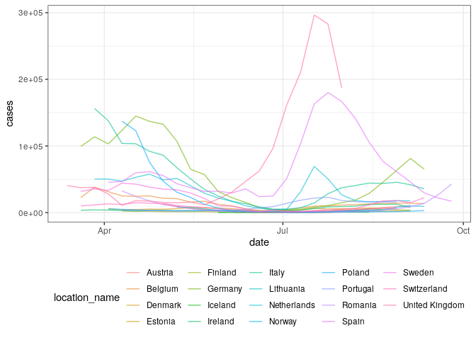
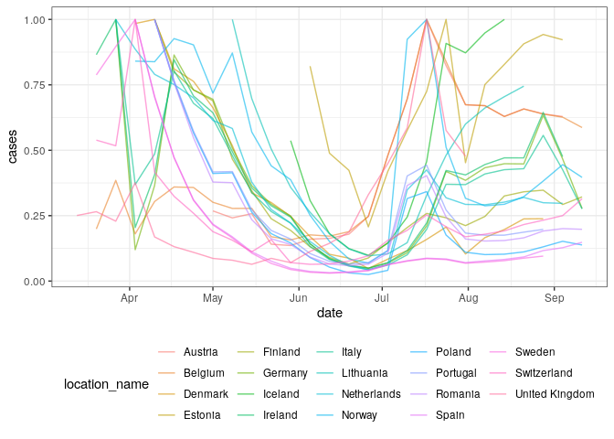
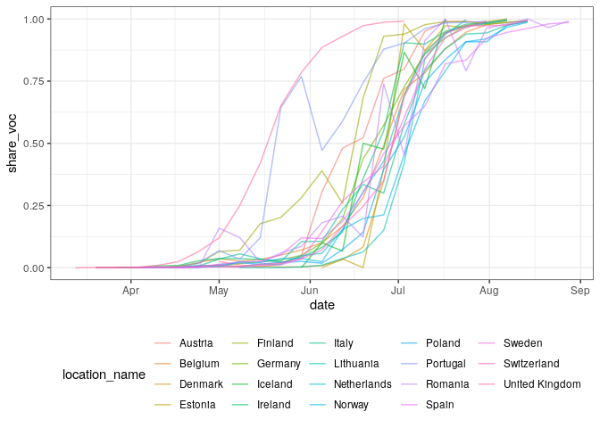
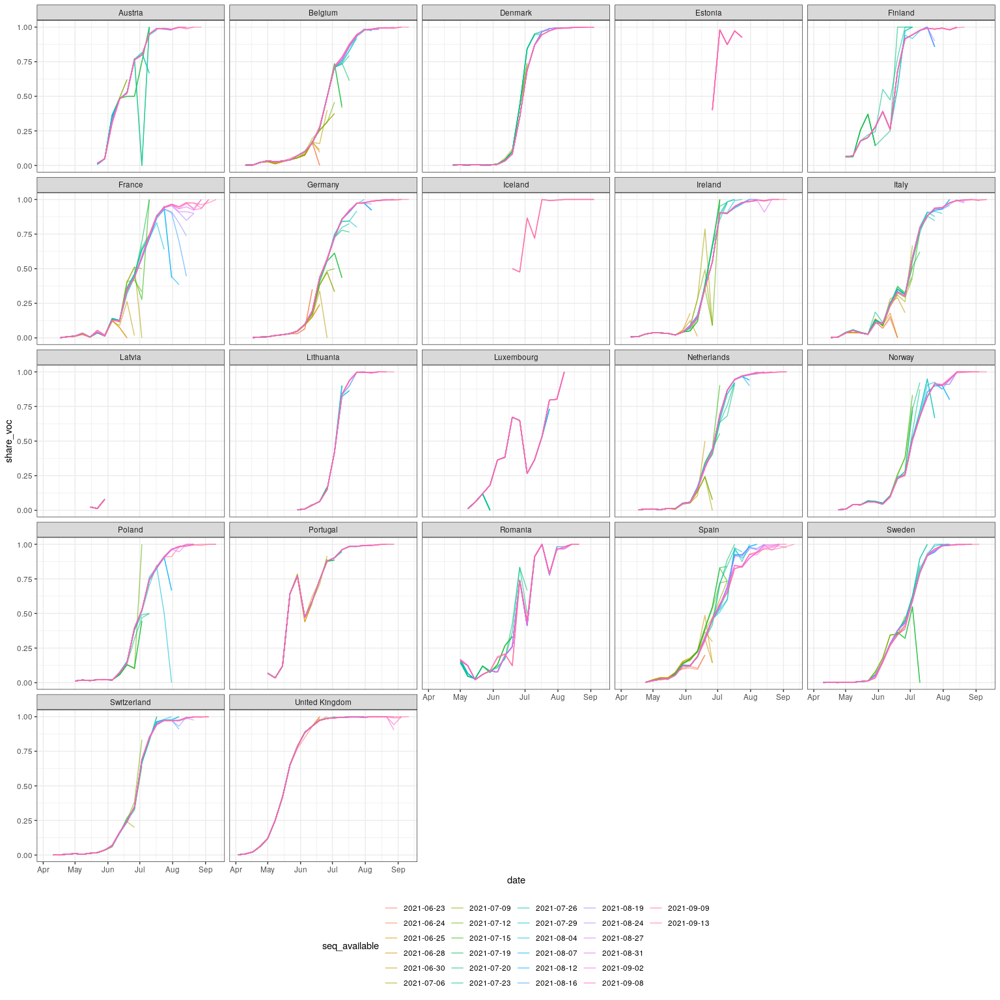
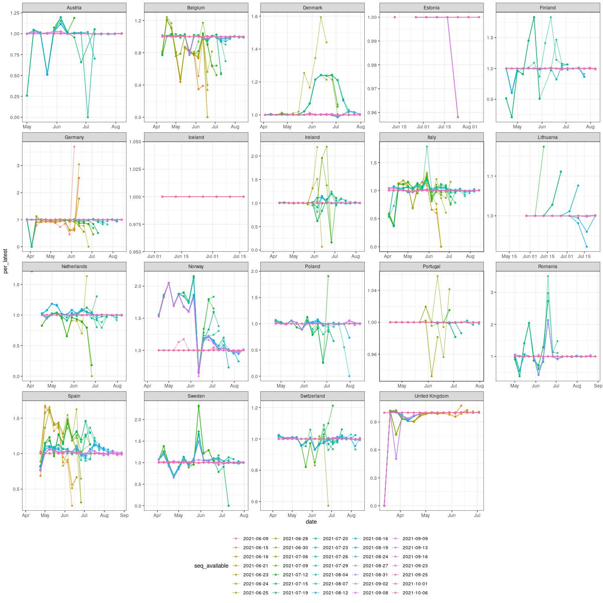

Aggregate case notification and sequence data for ECDC case studies
================

``` r
library(data.table)
library(jsonlite)
library(gh)
library(purrr)
library(ggplot2)
library(here)
```

## Case notification data

  - Load truth data from the ECDC via the ECDC forecasting hub and
    process.

<!-- end list -->

``` r
cases <- fread("https://raw.githubusercontent.com/epiforecasts/covid19-forecast-hub-europe/main/data-truth/JHU/truth_JHU-Incident%20Cases.csv") # nolint

# Format date
cases[, date := as.Date(date)]

# Summarise to weekly cases starting on Saturday to Sync with the forecast hubs
cases[, cases := frollsum(value, n = 7)]

# Filter from the 1st of January and keep only Saturdays
cases <- cases[date >= as.Date("2021-01-01")]
cases <- cases[weekdays(date) %in% "Saturday"]

# Only most recent case data is available
cases[, cases_available := date]

# Drop unnecessary columns
set(cases, j = c("value"), value = NULL)

# Summary
summary(cases)
```

    ##    location         location_name           date                cases       
    ##  Length:1184        Length:1184        Min.   :2021-01-02   Min.   :   703  
    ##  Class :character   Class :character   1st Qu.:2021-03-06   1st Qu.:  7568  
    ##  Mode  :character   Mode  :character   Median :2021-05-08   Median : 17761  
    ##                                        Mean   :2021-05-08   Mean   : 22682  
    ##                                        3rd Qu.:2021-07-10   3rd Qu.: 32887  
    ##                                        Max.   :2021-09-11   Max.   :111257  
    ##  cases_available     
    ##  Min.   :2021-01-02  
    ##  1st Qu.:2021-03-06  
    ##  Median :2021-05-08  
    ##  Mean   :2021-05-08  
    ##  3rd Qu.:2021-07-10  
    ##  Max.   :2021-09-11

## Sequence notification data

  - Define a function to download, load, and process sequence data from
    [covariants.org](https://covariants.org) (which itself process
    sequence data from [GISAID](https://www.gisaid.org)).

<!-- end list -->

``` r
download_covariants_sequences <- function(sha, path = "cluster_tables/21A.Delta_data.json") { # nolint
  if (missing(sha)) {
    url <- paste0(
      "https://raw.githubusercontent.com/hodcroftlab/covariants/master/", path
    )
  } else {
    url <- paste(
      "https://raw.githubusercontent.com/hodcroftlab/covariants",
      sha, path,
      sep = "/"
    )
  }
  sequences <- jsonlite::fromJSON(url)
  sequences <- purrr::map(sequences, as.data.table)
  sequences <- data.table::rbindlist(sequences, idcol = "location_name")
  return(sequences[])
}
```

  - Test by downloading the latest available data

<!-- end list -->

``` r
latest_sequences <- download_covariants_sequences()
latest_sequences
```

    ##             location_name       week total_sequences cluster_sequences
    ##    1:               India 2020-04-27              73                 0
    ##    2:               India 2020-05-04             170                 0
    ##    3:               India 2020-05-11             237                 0
    ##    4:               India 2020-05-18             288                 0
    ##    5:               India 2020-05-25             330                 0
    ##   ---                                                                 
    ## 4432: Trinidad and Tobago 2021-07-12               5                 0
    ## 4433: Trinidad and Tobago 2021-07-19               7                 0
    ## 4434: Trinidad and Tobago 2021-07-26              12                 0
    ## 4435: Trinidad and Tobago 2021-08-02              19                 0
    ## 4436: Trinidad and Tobago 2021-08-09              19                 0
    ##       unsmoothed_cluster_sequences unsmoothed_total_sequences
    ##    1:                            0                        250
    ##    2:                            0                        221
    ##    3:                            0                        280
    ##    4:                            0                        369
    ##    5:                            0                        357
    ##   ---                                                        
    ## 4432:                            0                          8
    ## 4433:                            0                          3
    ## 4434:                            1                         34
    ## 4435:                            1                         15
    ## 4436:                            0                         21

  - Get the commits to the target file in order to construct
    retrospective data

<!-- end list -->

``` r
covariants_file_commits <- function(path = "cluster_tables/21A.Delta_data.json") { # nolint
  commits <- gh::gh(
    "/repos/hodcroftlab/covariants/commits?path={path}",
    owner = "hodcroftlab",
    repo = "covariants",
    path = path
  )

  commits <- purrr::map(
    commits,
    ~ data.table(
      date = as.Date(as.character(.$commit$committer$date)),
      datetime = lubridate::as_datetime(
        as.character(.$commit$committer$date)
      ),
      author = .$commit$committer$name,
      message = .$commit$message,
      sha = .$sha
    )
  )
  commits <- data.table::rbindlist(commits)
  return(commits[])
}

delta_sequence_commits <- covariants_file_commits()
delta_sequence_commits
```

    ##           date            datetime        author
    ##  1: 2021-09-13 2021-09-13 23:21:26 Emma Hodcroft
    ##  2: 2021-09-13 2021-09-13 22:23:18 Emma Hodcroft
    ##  3: 2021-09-13 2021-09-13 21:25:16 Emma Hodcroft
    ##  4: 2021-09-09 2021-09-09 19:53:16 Emma Hodcroft
    ##  5: 2021-09-08 2021-09-08 09:09:40 Emma Hodcroft
    ##  6: 2021-09-02 2021-09-02 20:56:47 Emma Hodcroft
    ##  7: 2021-08-31 2021-08-31 17:23:10 Emma Hodcroft
    ##  8: 2021-08-27 2021-08-27 11:41:45 Emma Hodcroft
    ##  9: 2021-08-24 2021-08-24 16:03:34 Emma Hodcroft
    ## 10: 2021-08-19 2021-08-19 10:18:28 Emma Hodcroft
    ## 11: 2021-08-16 2021-08-16 13:42:49 Emma Hodcroft
    ## 12: 2021-08-12 2021-08-12 17:20:26 Emma Hodcroft
    ## 13: 2021-08-07 2021-08-07 19:06:34 Emma Hodcroft
    ## 14: 2021-08-07 2021-08-07 12:00:42 Emma Hodcroft
    ## 15: 2021-08-04 2021-08-04 12:40:46 Emma Hodcroft
    ## 16: 2021-07-29 2021-07-29 16:36:45 Emma Hodcroft
    ## 17: 2021-07-26 2021-07-26 19:10:57 Emma Hodcroft
    ## 18: 2021-07-23 2021-07-23 07:49:40 Emma Hodcroft
    ## 19: 2021-07-20 2021-07-20 12:31:24 Emma Hodcroft
    ## 20: 2021-07-19 2021-07-19 17:30:03 Emma Hodcroft
    ## 21: 2021-07-15 2021-07-15 13:45:20 Emma Hodcroft
    ## 22: 2021-07-12 2021-07-12 16:09:10 Emma Hodcroft
    ## 23: 2021-07-12 2021-07-12 12:09:29 Emma Hodcroft
    ## 24: 2021-07-09 2021-07-09 10:23:51 Emma Hodcroft
    ## 25: 2021-07-06 2021-07-06 12:28:54 Emma Hodcroft
    ## 26: 2021-06-30 2021-06-30 18:39:12 Emma Hodcroft
    ## 27: 2021-06-28 2021-06-28 09:59:18 Emma Hodcroft
    ## 28: 2021-06-25 2021-06-25 16:42:37 Emma Hodcroft
    ## 29: 2021-06-24 2021-06-24 09:28:09 Emma Hodcroft
    ## 30: 2021-06-23 2021-06-23 15:26:47 Emma Hodcroft
    ##           date            datetime        author
    ##                                             message
    ##  1:                                new data 13 sept
    ##  2:                     reverting to previous state
    ##  3:                                new data 13 Sept
    ##  4:                                 new data 9 sept
    ##  5:                                 new data 7 Sept
    ##  6:                                 new data 2 Sept
    ##  7:                                 new data 31 aug
    ##  8:                                 new data 26 Aug
    ##  9:                                 new data 24 Aug
    ## 10:                                 new data 18 aug
    ## 11:                                 new data 16 aug
    ## 12:                                 new data 12 Aug
    ## 13:                                  new data 9 Aug
    ## 14:                                  new data 6 aug
    ## 15:                                  new data 3 aug
    ## 16:                                new data 28 July
    ## 17:                                 new data 26 jul
    ## 18:                                 new data 22 Jul
    ## 19:                                 new data 19 jul
    ## 20:                                 new data 16 Jul
    ## 21:                                 new data 14 Jul
    ## 22:                    data replotted new var rules
    ## 23:                                  new data 9 jul
    ## 24:                                  new data 8 jul
    ## 25:                                 new data 6 july
    ## 26:                                 new data 29 Jun
    ## 27:                                 new data 26 jun
    ## 28:                                new data 24 June
    ## 29: new data generated using NextClade designations
    ## 30:                                new data 22 June
    ##                                             message
    ##                                          sha
    ##  1: 5f60ecf481dfb046ccf3dca5c86b780551f4458a
    ##  2: 8b4cb1438f41b8ed23f2f0bdd5c7012c8a0ffd40
    ##  3: 96fe12066eb71db9ab7679ee87a14d5735f8d0b4
    ##  4: c127f3ff4a9f8f208ed9064b4e9159d32a9b9818
    ##  5: ac958e9000ed08b7c6deb1622b9ffb47db7eae94
    ##  6: 0c7acdf40ca4ac3ae553bf412a988f085c68943a
    ##  7: 2430eb4e101c57505a630ddd894aa0c4b2ad70cf
    ##  8: 7cf11eec867fe928e1c5bd81f920a52cfe5b33ab
    ##  9: 4b6fa860c69ab47a723d5ce9f6f045a838710010
    ## 10: 351080f3f1589fd28ef9b422afce614a32265b4e
    ## 11: d71725a87033f93beb7fd24b8524a930a098c557
    ## 12: 129ae1643b1c4cbeb22e8d7544d4572b333220d9
    ## 13: 198da54a00d1ce80c9f1352b99a85771a6384470
    ## 14: ef6cbd29b7e428ff9b6549c8273b0b06151bc73f
    ## 15: cf043431414f7f67ff1256c6737b413ca13f460e
    ## 16: 0208e32e74c0bb6ddde5308a32454c5a07225777
    ## 17: 1de09fdb4c367caa00271ba50a734780237bbb02
    ## 18: 6b9722c2a1f215670f6624336d183175379eab4d
    ## 19: 3bcddc093bcf52eff245e4965d559d0e2970a78e
    ## 20: a022fda5d641f49b7ec0f3ed9107227a4a367d3c
    ## 21: 518ed2567557009307d0e9dbdfd1ef1646f175b1
    ## 22: 76a8638751df8add53cb0861dbdd3015e3730215
    ## 23: 1e9fb3051f7c02c8f994a9533e40daded3e30451
    ## 24: 4b8f686acb434b52e06f8035aab3e8bbbc0b7237
    ## 25: 3b7df3acae79ea0dee6afbfd8e673e799e14bbc0
    ## 26: 391f2da6da1d24eb32656c5f5b86f421d3cfc76f
    ## 27: 9469e2c735bb381e4d9bead9eac2f7e550ece97d
    ## 28: e07687cc89bd25013e780127ce493e81d509864e
    ## 29: 9e9ef20f25a41b44018d6c9607344eb48ceb4146
    ## 30: 7f58fae66e8e659a35eef80592d59e1af6c62802
    ##                                          sha

  - Keep only the last commits from any given day and download data from
    this commit.

<!-- end list -->

``` r
sequences <- delta_sequence_commits[order(date)][,
  .SD[datetime == max(datetime)],
  by = date
]
setnames(sequences, "date", "seq_available")
sequences[, data := purrr::map(sha, download_covariants_sequences)]
sequences <- sequences[, rbindlist(data), by = seq_available]
sequences
```

    ##        seq_available       location_name       week total_sequences
    ##     1:    2021-06-23               India 2020-04-27              73
    ##     2:    2021-06-23               India 2020-05-04             168
    ##     3:    2021-06-23               India 2020-05-11             235
    ##     4:    2021-06-23               India 2020-05-18             286
    ##     5:    2021-06-23               India 2020-05-25             326
    ##    ---                                                             
    ## 76208:    2021-09-13 Trinidad and Tobago 2021-07-12               5
    ## 76209:    2021-09-13 Trinidad and Tobago 2021-07-19               7
    ## 76210:    2021-09-13 Trinidad and Tobago 2021-07-26              12
    ## 76211:    2021-09-13 Trinidad and Tobago 2021-08-02              19
    ## 76212:    2021-09-13 Trinidad and Tobago 2021-08-09              19
    ##        cluster_sequences unsmoothed_cluster_sequences
    ##     1:                 0                            0
    ##     2:                 0                            0
    ##     3:                 0                            0
    ##     4:                 0                            0
    ##     5:                 0                            0
    ##    ---                                               
    ## 76208:                 0                            0
    ## 76209:                 0                            0
    ## 76210:                 0                            1
    ## 76211:                 0                            1
    ## 76212:                 0                            0
    ##        unsmoothed_total_sequences
    ##     1:                        248
    ##     2:                        218
    ##     3:                        278
    ##     4:                        369
    ##     5:                        357
    ##    ---                           
    ## 76208:                          8
    ## 76209:                          3
    ## 76210:                         34
    ## 76211:                         15
    ## 76212:                         21

  - Select and rename variables of interest.

<!-- end list -->

``` r
sequences <- sequences[
  ,
  .(
    seq_available = seq_available,
    location_name,
    week_starting = as.Date(week),
    week_ending = as.Date(week) + 6,
    seq_voc = unsmoothed_cluster_sequences,
    seq_total = unsmoothed_total_sequences
  )
][, share_voc := seq_voc / seq_total][]
sequences
```

    ##        seq_available       location_name week_starting week_ending seq_voc
    ##     1:    2021-06-23               India    2020-04-27  2020-05-03       0
    ##     2:    2021-06-23               India    2020-05-04  2020-05-10       0
    ##     3:    2021-06-23               India    2020-05-11  2020-05-17       0
    ##     4:    2021-06-23               India    2020-05-18  2020-05-24       0
    ##     5:    2021-06-23               India    2020-05-25  2020-05-31       0
    ##    ---                                                                    
    ## 76208:    2021-09-13 Trinidad and Tobago    2021-07-12  2021-07-18       0
    ## 76209:    2021-09-13 Trinidad and Tobago    2021-07-19  2021-07-25       0
    ## 76210:    2021-09-13 Trinidad and Tobago    2021-07-26  2021-08-01       1
    ## 76211:    2021-09-13 Trinidad and Tobago    2021-08-02  2021-08-08       1
    ## 76212:    2021-09-13 Trinidad and Tobago    2021-08-09  2021-08-15       0
    ##        seq_total  share_voc
    ##     1:       248 0.00000000
    ##     2:       218 0.00000000
    ##     3:       278 0.00000000
    ##     4:       369 0.00000000
    ##     5:       357 0.00000000
    ##    ---                     
    ## 76208:         8 0.00000000
    ## 76209:         3 0.00000000
    ## 76210:        34 0.02941176
    ## 76211:        15 0.06666667
    ## 76212:        21 0.00000000

## Filter, merge, and save cases notifications and sequences

  - Filter sequences to include dates by location starting from when two
    consecutive weeks have at least two sequences that were positive for
    the Delta variant and the Delta variant makes up at least 0.001% of
    available sequences. This filtering step is based on the first
    available data and then used as a common starting point across all
    releases. First find the introduction week for each location based
    on these filtering steps.

<!-- end list -->

``` r
first_seq <- sequences[,
  .SD[seq_available == min(seq_available)][
    seq_voc >= 2 & shift(seq_voc, type = "lead") >= 2
  ][
    share_voc >= 0.001 & shift(share_voc, type = "lead") >= 0.001
  ][
    order(week_ending)
  ][1, ],
  by = "location_name"
][!is.na(seq_voc)][]
first_seq
```

    ##      location_name seq_available week_starting week_ending seq_voc seq_total
    ##  1:          India    2021-06-23    2021-02-01  2021-02-07      10       472
    ##  2:      Singapore    2021-06-23    2021-03-29  2021-04-04       2       107
    ##  3:            USA    2021-06-23    2021-04-05  2021-04-11      49     35927
    ##  4:        Germany    2021-06-23    2021-04-12  2021-04-18      18     10759
    ##  5: United Kingdom    2021-06-23    2021-03-29  2021-04-04      22     12031
    ##  6:          Italy    2021-06-23    2021-04-12  2021-04-18       3      1649
    ##  7:        Belgium    2021-06-23    2021-04-05  2021-04-11       3      1268
    ##  8:         Russia    2021-06-23    2021-04-19  2021-04-25       5       157
    ##  9:          Spain    2021-06-23    2021-04-19  2021-04-25       2       865
    ## 10:      Indonesia    2021-06-25    2021-01-04  2021-01-10       2       172
    ## 11:        Ireland    2021-06-25    2021-04-05  2021-04-11       5       697
    ## 12:         France    2021-06-25    2021-04-12  2021-04-18       3      2942
    ## 13:       Portugal    2021-06-25    2021-04-26  2021-05-02       3        44
    ## 14:        Denmark    2021-06-28    2021-04-19  2021-04-25      12      3537
    ## 15:    Netherlands    2021-06-28    2021-04-12  2021-04-18       4      1772
    ## 16:   South Africa    2021-06-30    2021-03-08  2021-03-14       7       242
    ## 17:      Australia    2021-07-06    2021-04-12  2021-04-18      26        94
    ## 18:         Canada    2021-07-06    2021-04-05  2021-04-11      13      2357
    ## 19:          Japan    2021-07-06    2021-04-05  2021-04-11       7      2358
    ## 20:         Sweden    2021-07-06    2021-04-05  2021-04-11       3      2413
    ## 21:    Switzerland    2021-07-06    2021-04-05  2021-04-11       3      1445
    ## 22:        Austria    2021-07-06    2021-05-17  2021-05-23       2       234
    ## 23:         Mexico    2021-07-06    2021-05-03  2021-05-09      12       824
    ## 24:         Israel    2021-07-09    2021-04-05  2021-04-11      26       187
    ## 25:        Romania    2021-07-12    2021-04-26  2021-05-02       2        13
    ## 26:          Kenya    2021-07-12    2021-04-26  2021-05-02       9        68
    ## 27:      Sri Lanka    2021-07-12    2021-06-07  2021-06-13       4        36
    ## 28:     Luxembourg    2021-07-12    2021-05-03  2021-05-09       4       333
    ## 29:         Norway    2021-07-12    2021-04-19  2021-04-25       2       458
    ## 30:          Qatar    2021-07-12    2021-04-12  2021-04-18       3        91
    ## 31:        Finland    2021-07-12    2021-04-26  2021-05-02      15       240
    ## 32:         Poland    2021-07-12    2021-04-26  2021-05-02      15      1214
    ## 33: Czech Republic    2021-07-12    2021-05-03  2021-05-09      11       133
    ## 34:     Bangladesh    2021-07-12    2021-04-26  2021-05-02      10        23
    ## 35:       Malaysia    2021-07-12    2021-04-26  2021-05-02       3        33
    ## 36:       Botswana    2021-07-12    2021-05-24  2021-05-30       2         8
    ## 37:       Thailand    2021-07-12    2021-05-10  2021-05-16      52       303
    ## 38:         Latvia    2021-07-12    2021-05-10  2021-05-16       3       125
    ## 39:       Cambodia    2021-07-12    2021-05-24  2021-05-30       3        24
    ## 40:      Lithuania    2021-07-12    2021-05-24  2021-05-30       2       706
    ## 41:         Uganda    2021-08-04    2021-05-24  2021-05-30       4         4
    ## 42:        Lebanon    2021-08-16    2021-06-21  2021-06-27       4         4
    ## 43:    New Zealand    2021-08-24    2021-03-29  2021-04-04       3        18
    ## 44:        Estonia    2021-08-24    2021-06-21  2021-06-27       2         5
    ## 45:        Bahrain    2021-08-27    2021-05-03  2021-05-09       3        12
    ## 46:     Costa Rica    2021-08-27    2021-06-14  2021-06-20       2        26
    ## 47:     Mozambique    2021-08-27    2021-06-28  2021-07-04      13        13
    ## 48:       Zimbabwe    2021-08-31    2021-06-21  2021-06-27       2         3
    ## 49:       Pakistan    2021-09-02    2021-05-17  2021-05-23       7        13
    ## 50:        Iceland    2021-09-08    2021-06-14  2021-06-20       8        16
    ##      location_name seq_available week_starting week_ending seq_voc seq_total
    ##       share_voc
    ##  1: 0.021186441
    ##  2: 0.018691589
    ##  3: 0.001363877
    ##  4: 0.001673018
    ##  5: 0.001828609
    ##  6: 0.001819284
    ##  7: 0.002365931
    ##  8: 0.031847134
    ##  9: 0.002312139
    ## 10: 0.011627907
    ## 11: 0.007173601
    ## 12: 0.001019714
    ## 13: 0.068181818
    ## 14: 0.003392706
    ## 15: 0.002257336
    ## 16: 0.028925620
    ## 17: 0.276595745
    ## 18: 0.005515486
    ## 19: 0.002968617
    ## 20: 0.001243266
    ## 21: 0.002076125
    ## 22: 0.008547009
    ## 23: 0.014563107
    ## 24: 0.139037433
    ## 25: 0.153846154
    ## 26: 0.132352941
    ## 27: 0.111111111
    ## 28: 0.012012012
    ## 29: 0.004366812
    ## 30: 0.032967033
    ## 31: 0.062500000
    ## 32: 0.012355848
    ## 33: 0.082706767
    ## 34: 0.434782609
    ## 35: 0.090909091
    ## 36: 0.250000000
    ## 37: 0.171617162
    ## 38: 0.024000000
    ## 39: 0.125000000
    ## 40: 0.002832861
    ## 41: 1.000000000
    ## 42: 1.000000000
    ## 43: 0.166666667
    ## 44: 0.400000000
    ## 45: 0.250000000
    ## 46: 0.076923077
    ## 47: 1.000000000
    ## 48: 0.666666667
    ## 49: 0.538461538
    ## 50: 0.500000000
    ##       share_voc

  - Restrict included sequences to start from these introduction dates.

<!-- end list -->

``` r
filt_sequences <- merge(
  sequences, first_seq[, .(location_name, intro_date = week_ending)],
  by = "location_name"
)
filt_sequences <- filt_sequences[week_ending >= intro_date][
  ,
  intro_date := NULL
][]
```

  - Filter case notifications to start 4 weeks prior to the introduction
    date of the Delta variant.

<!-- end list -->

``` r
filt_cases <- merge(
  cases, first_seq[, .(location_name, intro_date = week_ending)],
  by = c("location_name")
)
filt_cases <- filt_cases[date >= (intro_date - 7 * 4)][, intro_date := NULL]
```

  - Merge duplicating case data for all sequence versions. Sequences are
    only available aggregated by week from Sunday. Approximate the same
    timespan as the case data by changing the weekly reference date

<!-- end list -->

``` r
adjusted_seq <- copy(filt_sequences)[
  ,
  date := week_ending - 1
][, c("week_starting", "week_ending") := NULL]

notifications <- merge(filt_cases, adjusted_seq,
  by = c("date", "location_name"), all.x = TRUE
)

setorderv(notifications, c("location_name", "seq_available", "date"))
```

  - Save and summarise filtered notification data.

<!-- end list -->

``` r
# save to observations folder
fwrite(notifications, file = here("data/observations/covariants.csv"))

# Summary
summary(notifications)
```

    ##       date            location_name        location             cases      
    ##  Min.   :2021-03-13   Length:6309        Length:6309        Min.   :  703  
    ##  1st Qu.:2021-05-15   Class :character   Class :character   1st Qu.: 3459  
    ##  Median :2021-06-12   Mode  :character   Mode  :character   Median : 7489  
    ##  Mean   :2021-06-11                                         Mean   :14075  
    ##  3rd Qu.:2021-07-10                                         3rd Qu.:18315  
    ##  Max.   :2021-09-11                                         Max.   :97990  
    ##                                                                            
    ##  cases_available      seq_available           seq_voc          seq_total      
    ##  Min.   :2021-03-13   Min.   :2021-06-23   Min.   :    0.0   Min.   :    1.0  
    ##  1st Qu.:2021-05-15   1st Qu.:2021-07-23   1st Qu.:   18.0   1st Qu.:  281.0  
    ##  Median :2021-06-12   Median :2021-08-16   Median :   63.0   Median :  881.5  
    ##  Mean   :2021-06-11   Mean   :2021-08-11   Mean   : 1065.5   Mean   : 2179.0  
    ##  3rd Qu.:2021-07-10   3rd Qu.:2021-08-31   3rd Qu.:  358.8   3rd Qu.: 1764.0  
    ##  Max.   :2021-09-11   Max.   :2021-09-13   Max.   :33929.0   Max.   :34034.0  
    ##                       NA's   :111          NA's   :111       NA's   :111      
    ##    share_voc      
    ##  Min.   :0.00000  
    ##  1st Qu.:0.02676  
    ##  Median :0.19044  
    ##  Mean   :0.38934  
    ##  3rd Qu.:0.84287  
    ##  Max.   :1.00000  
    ##  NA's   :111

## Explore notifications

  - Case notifications

<!-- end list -->

``` r
not_cases <- unique(notifications[, .(date, cases, location_name)])
# plot cases
ggplot(not_cases) +
  aes(x = date, y = cases, col = location_name) +
  geom_line(alpha = 0.6) +
  theme_bw() +
  theme(legend.position = "bottom")
```

<!-- -->

  - Case notifications normalised by maximum number of notifications in
    that location.

<!-- end list -->

``` r
ggplot(not_cases[, cases := cases / max(cases), by = "location_name"]) +
  aes(x = date, y = cases, col = location_name) +
  geom_line(alpha = 0.6) +
  theme_bw() +
  theme(legend.position = "bottom")
```

<!-- -->

  - Share of sequences that were positive for the Delta variant based on
    the lastest available data.

<!-- end list -->

``` r
ggplot(notifications[seq_available == max(seq_available, na.rm = TRUE)]) +
  aes(x = date, y = share_voc, col = location_name) +
  geom_line(alpha = 0.6) +
  theme_bw() +
  theme(legend.position = "bottom")
```

<!-- -->

  - Share of sequences that were positive for the Delta variant based on
    the first available data.

<!-- end list -->

``` r
ggplot(notifications[seq_available == min(seq_available, na.rm = TRUE)]) +
  aes(x = date, y = share_voc, col = location_name) +
  geom_line(alpha = 0.6) +
  theme_bw() +
  theme(legend.position = "bottom")
```

<!-- -->

  - Share of sequences positive for Delta by availability

<!-- end list -->

``` r
ggplot(
  notifications[!is.na(seq_available)][,
                seq_available := as.factor(seq_available)]
) +
  aes(x = date, y = share_voc, col = seq_available) +
  geom_line(alpha = 0.6) +
  theme_bw() +
  theme(legend.position = "bottom") + 
  facet_wrap(vars(location_name))
```

<!-- -->

  - Relative change in the proportion of sequences that were Delta
    between each release of sequence data and the latest available
    release.

<!-- end list -->

``` r
latest_seq <- notifications[,
  n := .N, by = c("date", "location_name")
][, .SD[seq_available == max(seq_available)],
  by = c("date", "location_name")
][n > 1]

seq_change <- merge(
  notifications[!is.na(seq_available)][,
                seq_available := as.factor(seq_available)][,
                .(location_name, date, share_voc, seq_available)],
  latest_seq[, .(location_name, date, latest_voc = share_voc)],
  by = c("location_name", "date")
)

seq_change[, per_latest := share_voc / latest_voc]

seq_change <- seq_change[date <= as.Date("2021-09-01")]

ggplot(seq_change) +
  aes(x = date, y = per_latest, col = seq_available, group = seq_available) +
  geom_point(size = 1.1, alpha = 0.8) +
  geom_line(alpha = 0.6) +
  theme_bw() +
  theme(legend.position = "bottom") +
  facet_wrap(vars(location_name), scales = "free")
```

<!-- -->
