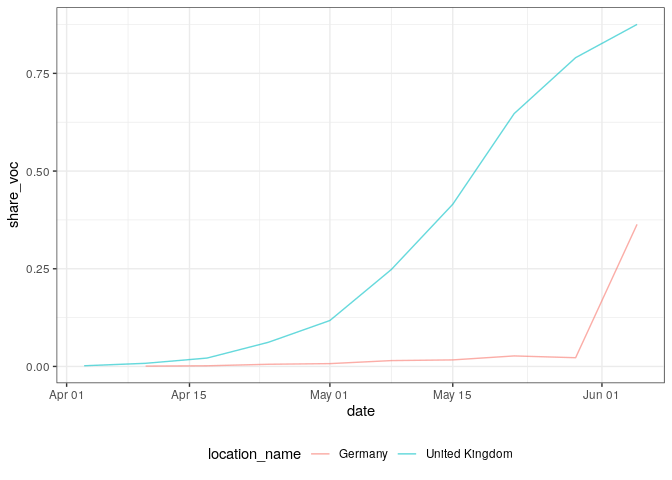
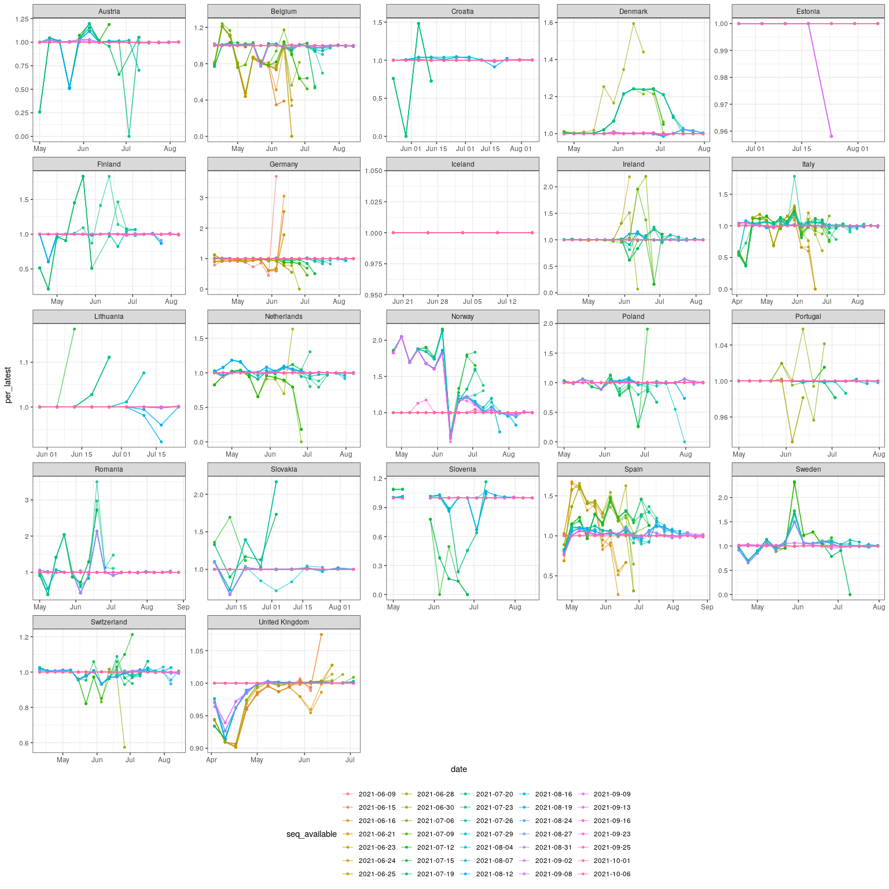

Aggregate case notification and sequence data for ECDC case studies
================

``` r
library(data.table)
library(jsonlite)
library(gh)
library(purrr)
library(ggplot2)
library(here)
```

## Case notification data

  - Load truth data from the ECDC via the ECDC forecasting hub and
    process.

<!-- end list -->

``` r
cases <- fread("https://raw.githubusercontent.com/epiforecasts/covid19-forecast-hub-europe/main/data-truth/JHU/truth_JHU-Incident%20Cases.csv") # nolint

# Format date
cases[, date := as.Date(date)]

# Summarise to weekly cases starting on Saturday to Sync with the forecast hubs
cases[, cases := frollsum(value, n = 7)]

# Filter from the 1st of January and keep only Saturdays
cases <- cases[date >= as.Date("2021-01-01")]
cases <- cases[weekdays(date) %in% "Saturday"]

# Only most recent case data is available
cases[, cases_available := date]

# Drop unnecessary columns
set(cases, j = c("value"), value = NULL)

# Summary
summary(cases)
```

    ##    location         location_name           date                cases        cases_available     
    ##  Length:1184        Length:1184        Min.   :2021-01-02   Min.   :   703   Min.   :2021-01-02  
    ##  Class :character   Class :character   1st Qu.:2021-03-06   1st Qu.:  7568   1st Qu.:2021-03-06  
    ##  Mode  :character   Mode  :character   Median :2021-05-08   Median : 17761   Median :2021-05-08  
    ##                                        Mean   :2021-05-08   Mean   : 22682   Mean   :2021-05-08  
    ##                                        3rd Qu.:2021-07-10   3rd Qu.: 32887   3rd Qu.:2021-07-10  
    ##                                        Max.   :2021-09-11   Max.   :111257   Max.   :2021-09-11

## Sequence notification data

  - Define a function to download, load, and process sequence data from
    [covariants.org](https://covariants.org) (which itself process
    sequence data from [GISAID](https://www.gisaid.org)).

<!-- end list -->

``` r
download_covariants_sequences <- function(sha, path = "cluster_tables/21A.Delta_data.json") { # nolint
  if (missing(sha)) {
    url <- paste0(
      "https://raw.githubusercontent.com/hodcroftlab/covariants/master/", path
    )
  } else {
    url <- paste(
      "https://raw.githubusercontent.com/hodcroftlab/covariants",
      sha, path,
      sep = "/"
    )
  }
  sequences <- jsonlite::fromJSON(url)
  sequences <- purrr::map(sequences, as.data.table)
  sequences <- data.table::rbindlist(sequences, idcol = "location_name")
  return(sequences[])
}
```

  - Test by downloading the latest available data

<!-- end list -->

``` r
latest_sequences <- download_covariants_sequences()
latest_sequences
```

    ##             location_name       week total_sequences cluster_sequences
    ##    1:               India 2020-04-27              73                 0
    ##    2:               India 2020-05-04             170                 0
    ##    3:               India 2020-05-11             237                 0
    ##    4:               India 2020-05-18             288                 0
    ##    5:               India 2020-05-25             330                 0
    ##   ---                                                                 
    ## 4449: Trinidad and Tobago 2021-07-12               5                 0
    ## 4450: Trinidad and Tobago 2021-07-19               7                 0
    ## 4451: Trinidad and Tobago 2021-07-26              12                 0
    ## 4452: Trinidad and Tobago 2021-08-02              19                 0
    ## 4453: Trinidad and Tobago 2021-08-09              19                 0
    ##       unsmoothed_cluster_sequences unsmoothed_total_sequences
    ##    1:                            0                        250
    ##    2:                            0                        221
    ##    3:                            0                        280
    ##    4:                            0                        369
    ##    5:                            0                        357
    ##   ---                                                        
    ## 4449:                            0                          8
    ## 4450:                            0                          3
    ## 4451:                            1                         34
    ## 4452:                            1                         15
    ## 4453:                            0                         21

  - Get the commits to the target file in order to construct
    retrospective data

<!-- end list -->

``` r
covariants_file_commits <- function(path = "cluster_tables/21A.Delta_data.json") { # nolint
  commits <- gh::gh(
    "/repos/hodcroftlab/covariants/commits?path={path}",
    owner = "hodcroftlab",
    repo = "covariants",
    path = path
  )

  commits <- purrr::map(
    commits,
    ~ data.table(
      date = as.Date(as.character(.$commit$committer$date)),
      datetime = lubridate::as_datetime(
        as.character(.$commit$committer$date)
      ),
      author = .$commit$committer$name,
      message = .$commit$message,
      sha = .$sha
    )
  )
  commits <- data.table::rbindlist(commits)
  return(commits[])
}

delta_sequence_commits <- covariants_file_commits()
delta_sequence_commits
```

    ##           date            datetime        author                                         message
    ##  1: 2021-09-16 2021-09-16 18:27:24 Emma Hodcroft                                new data 16 Sept
    ##  2: 2021-09-13 2021-09-13 23:21:26 Emma Hodcroft                                new data 13 sept
    ##  3: 2021-09-13 2021-09-13 22:23:18 Emma Hodcroft                     reverting to previous state
    ##  4: 2021-09-13 2021-09-13 21:25:16 Emma Hodcroft                                new data 13 Sept
    ##  5: 2021-09-09 2021-09-09 19:53:16 Emma Hodcroft                                 new data 9 sept
    ##  6: 2021-09-08 2021-09-08 09:09:40 Emma Hodcroft                                 new data 7 Sept
    ##  7: 2021-09-02 2021-09-02 20:56:47 Emma Hodcroft                                 new data 2 Sept
    ##  8: 2021-08-31 2021-08-31 17:23:10 Emma Hodcroft                                 new data 31 aug
    ##  9: 2021-08-27 2021-08-27 11:41:45 Emma Hodcroft                                 new data 26 Aug
    ## 10: 2021-08-24 2021-08-24 16:03:34 Emma Hodcroft                                 new data 24 Aug
    ## 11: 2021-08-19 2021-08-19 10:18:28 Emma Hodcroft                                 new data 18 aug
    ## 12: 2021-08-16 2021-08-16 13:42:49 Emma Hodcroft                                 new data 16 aug
    ## 13: 2021-08-12 2021-08-12 17:20:26 Emma Hodcroft                                 new data 12 Aug
    ## 14: 2021-08-07 2021-08-07 19:06:34 Emma Hodcroft                                  new data 9 Aug
    ## 15: 2021-08-07 2021-08-07 12:00:42 Emma Hodcroft                                  new data 6 aug
    ## 16: 2021-08-04 2021-08-04 12:40:46 Emma Hodcroft                                  new data 3 aug
    ## 17: 2021-07-29 2021-07-29 16:36:45 Emma Hodcroft                                new data 28 July
    ## 18: 2021-07-26 2021-07-26 19:10:57 Emma Hodcroft                                 new data 26 jul
    ## 19: 2021-07-23 2021-07-23 07:49:40 Emma Hodcroft                                 new data 22 Jul
    ## 20: 2021-07-20 2021-07-20 12:31:24 Emma Hodcroft                                 new data 19 jul
    ## 21: 2021-07-19 2021-07-19 17:30:03 Emma Hodcroft                                 new data 16 Jul
    ## 22: 2021-07-15 2021-07-15 13:45:20 Emma Hodcroft                                 new data 14 Jul
    ## 23: 2021-07-12 2021-07-12 16:09:10 Emma Hodcroft                    data replotted new var rules
    ## 24: 2021-07-12 2021-07-12 12:09:29 Emma Hodcroft                                  new data 9 jul
    ## 25: 2021-07-09 2021-07-09 10:23:51 Emma Hodcroft                                  new data 8 jul
    ## 26: 2021-07-06 2021-07-06 12:28:54 Emma Hodcroft                                 new data 6 july
    ## 27: 2021-06-30 2021-06-30 18:39:12 Emma Hodcroft                                 new data 29 Jun
    ## 28: 2021-06-28 2021-06-28 09:59:18 Emma Hodcroft                                 new data 26 jun
    ## 29: 2021-06-25 2021-06-25 16:42:37 Emma Hodcroft                                new data 24 June
    ## 30: 2021-06-24 2021-06-24 09:28:09 Emma Hodcroft new data generated using NextClade designations
    ##           date            datetime        author                                         message
    ##                                          sha
    ##  1: aad7732893fe58464206ef5dac91c9e92324586b
    ##  2: 5f60ecf481dfb046ccf3dca5c86b780551f4458a
    ##  3: 8b4cb1438f41b8ed23f2f0bdd5c7012c8a0ffd40
    ##  4: 96fe12066eb71db9ab7679ee87a14d5735f8d0b4
    ##  5: c127f3ff4a9f8f208ed9064b4e9159d32a9b9818
    ##  6: ac958e9000ed08b7c6deb1622b9ffb47db7eae94
    ##  7: 0c7acdf40ca4ac3ae553bf412a988f085c68943a
    ##  8: 2430eb4e101c57505a630ddd894aa0c4b2ad70cf
    ##  9: 7cf11eec867fe928e1c5bd81f920a52cfe5b33ab
    ## 10: 4b6fa860c69ab47a723d5ce9f6f045a838710010
    ## 11: 351080f3f1589fd28ef9b422afce614a32265b4e
    ## 12: d71725a87033f93beb7fd24b8524a930a098c557
    ## 13: 129ae1643b1c4cbeb22e8d7544d4572b333220d9
    ## 14: 198da54a00d1ce80c9f1352b99a85771a6384470
    ## 15: ef6cbd29b7e428ff9b6549c8273b0b06151bc73f
    ## 16: cf043431414f7f67ff1256c6737b413ca13f460e
    ## 17: 0208e32e74c0bb6ddde5308a32454c5a07225777
    ## 18: 1de09fdb4c367caa00271ba50a734780237bbb02
    ## 19: 6b9722c2a1f215670f6624336d183175379eab4d
    ## 20: 3bcddc093bcf52eff245e4965d559d0e2970a78e
    ## 21: a022fda5d641f49b7ec0f3ed9107227a4a367d3c
    ## 22: 518ed2567557009307d0e9dbdfd1ef1646f175b1
    ## 23: 76a8638751df8add53cb0861dbdd3015e3730215
    ## 24: 1e9fb3051f7c02c8f994a9533e40daded3e30451
    ## 25: 4b8f686acb434b52e06f8035aab3e8bbbc0b7237
    ## 26: 3b7df3acae79ea0dee6afbfd8e673e799e14bbc0
    ## 27: 391f2da6da1d24eb32656c5f5b86f421d3cfc76f
    ## 28: 9469e2c735bb381e4d9bead9eac2f7e550ece97d
    ## 29: e07687cc89bd25013e780127ce493e81d509864e
    ## 30: 9e9ef20f25a41b44018d6c9607344eb48ceb4146
    ##                                          sha

  - Keep only the last commits from any given day and download data from
    this commit.

<!-- end list -->

``` r
sequences <- delta_sequence_commits[order(date)][,
  .SD[datetime == max(datetime)],
  by = date
]
setnames(sequences, "date", "seq_available")
sequences[, data := purrr::map(sha, download_covariants_sequences)]
sequences <- sequences[, rbindlist(data), by = seq_available]
sequences
```

    ##        seq_available       location_name       week total_sequences cluster_sequences
    ##     1:    2021-06-24               India 2020-04-27              73                 0
    ##     2:    2021-06-24               India 2020-05-04             168                 0
    ##     3:    2021-06-24               India 2020-05-11             235                 0
    ##     4:    2021-06-24               India 2020-05-18             286                 0
    ##     5:    2021-06-24               India 2020-05-25             326                 0
    ##    ---                                                                               
    ## 80126:    2021-09-16 Trinidad and Tobago 2021-07-12               5                 0
    ## 80127:    2021-09-16 Trinidad and Tobago 2021-07-19               7                 0
    ## 80128:    2021-09-16 Trinidad and Tobago 2021-07-26              12                 0
    ## 80129:    2021-09-16 Trinidad and Tobago 2021-08-02              19                 0
    ## 80130:    2021-09-16 Trinidad and Tobago 2021-08-09              19                 0
    ##        unsmoothed_cluster_sequences unsmoothed_total_sequences
    ##     1:                            0                        248
    ##     2:                            0                        218
    ##     3:                            0                        278
    ##     4:                            0                        369
    ##     5:                            0                        357
    ##    ---                                                        
    ## 80126:                            0                          8
    ## 80127:                            0                          3
    ## 80128:                            1                         34
    ## 80129:                            1                         15
    ## 80130:                            0                         21

  - Select and rename variables of interest.

<!-- end list -->

``` r
sequences <- sequences[
  ,
  .(
    seq_available = seq_available,
    location_name,
    week_starting = as.Date(week),
    week_ending = as.Date(week) + 6,
    seq_voc = unsmoothed_cluster_sequences,
    seq_total = unsmoothed_total_sequences
  )
][, share_voc := seq_voc / seq_total][]
sequences
```

    ##        seq_available       location_name week_starting week_ending seq_voc seq_total  share_voc
    ##     1:    2021-06-24               India    2020-04-27  2020-05-03       0       248 0.00000000
    ##     2:    2021-06-24               India    2020-05-04  2020-05-10       0       218 0.00000000
    ##     3:    2021-06-24               India    2020-05-11  2020-05-17       0       278 0.00000000
    ##     4:    2021-06-24               India    2020-05-18  2020-05-24       0       369 0.00000000
    ##     5:    2021-06-24               India    2020-05-25  2020-05-31       0       357 0.00000000
    ##    ---                                                                                         
    ## 80126:    2021-09-16 Trinidad and Tobago    2021-07-12  2021-07-18       0         8 0.00000000
    ## 80127:    2021-09-16 Trinidad and Tobago    2021-07-19  2021-07-25       0         3 0.00000000
    ## 80128:    2021-09-16 Trinidad and Tobago    2021-07-26  2021-08-01       1        34 0.02941176
    ## 80129:    2021-09-16 Trinidad and Tobago    2021-08-02  2021-08-08       1        15 0.06666667
    ## 80130:    2021-09-16 Trinidad and Tobago    2021-08-09  2021-08-15       0        21 0.00000000

## Filter, merge, and save cases notifications and sequences

  - Filter sequences to include dates by location starting from when two
    consecutive weeks have at least two sequences that were positive for
    the Delta variant and the Delta variant makes up at least 0.001% of
    available sequences. This filtering step is based on the first
    available data and then used as a common starting point across all
    releases. First find the introduction week for each location based
    on these filtering steps.

<!-- end list -->

``` r
first_seq <- sequences[,
  .SD[seq_available == min(seq_available)][
    seq_voc >= 2 & shift(seq_voc, type = "lead") >= 2
  ][
    share_voc >= 0.001 & shift(share_voc, type = "lead") >= 0.001
  ][
    order(week_ending)
  ][1, ],
  by = "location_name"
][!is.na(seq_voc)][]
first_seq
```

    ##      location_name seq_available week_starting week_ending seq_voc seq_total   share_voc
    ##  1:          India    2021-06-24    2020-11-16  2020-11-22       3        67 0.044776119
    ##  2:      Singapore    2021-06-24    2021-03-29  2021-04-04       2       107 0.018691589
    ##  3:            USA    2021-06-24    2021-04-05  2021-04-11      49     35927 0.001363877
    ##  4: United Kingdom    2021-06-24    2021-03-29  2021-04-04      22     12031 0.001828609
    ##  5:        Germany    2021-06-24    2021-04-12  2021-04-18      19     10759 0.001765963
    ##  6:          Italy    2021-06-24    2021-04-12  2021-04-18       3      1649 0.001819284
    ##  7:        Belgium    2021-06-24    2021-04-05  2021-04-11       3      1268 0.002365931
    ##  8:         Russia    2021-06-24    2021-04-19  2021-04-25       5       157 0.031847134
    ##  9:          Spain    2021-06-24    2021-04-19  2021-04-25       3       865 0.003468208
    ## 10:      Indonesia    2021-06-25    2021-01-04  2021-01-10       2       172 0.011627907
    ## 11:        Ireland    2021-06-25    2021-04-05  2021-04-11       5       697 0.007173601
    ## 12:         France    2021-06-25    2021-04-12  2021-04-18       3      2942 0.001019714
    ## 13:       Portugal    2021-06-25    2021-04-26  2021-05-02       3        44 0.068181818
    ## 14:        Denmark    2021-06-28    2021-04-19  2021-04-25      12      3537 0.003392706
    ## 15:    Netherlands    2021-06-28    2021-04-12  2021-04-18       4      1772 0.002257336
    ## 16:   South Africa    2021-06-30    2021-03-08  2021-03-14       7       242 0.028925620
    ## 17:      Australia    2021-07-06    2021-04-12  2021-04-18      26        94 0.276595745
    ## 18:         Canada    2021-07-06    2021-04-05  2021-04-11      13      2357 0.005515486
    ## 19:          Japan    2021-07-06    2021-04-05  2021-04-11       7      2358 0.002968617
    ## 20:         Sweden    2021-07-06    2021-04-05  2021-04-11       3      2413 0.001243266
    ## 21:    Switzerland    2021-07-06    2021-04-05  2021-04-11       3      1445 0.002076125
    ## 22:        Austria    2021-07-06    2021-05-17  2021-05-23       2       234 0.008547009
    ## 23:         Mexico    2021-07-06    2021-05-03  2021-05-09      12       824 0.014563107
    ## 24:         Israel    2021-07-09    2021-04-05  2021-04-11      26       187 0.139037433
    ## 25:        Romania    2021-07-12    2021-04-26  2021-05-02       2        13 0.153846154
    ## 26:          Kenya    2021-07-12    2021-04-26  2021-05-02       9        68 0.132352941
    ## 27:      Sri Lanka    2021-07-12    2021-06-07  2021-06-13       4        36 0.111111111
    ## 28:     Luxembourg    2021-07-12    2021-05-03  2021-05-09       4       333 0.012012012
    ## 29:         Norway    2021-07-12    2021-04-19  2021-04-25       2       458 0.004366812
    ## 30:          Qatar    2021-07-12    2021-04-12  2021-04-18       3        91 0.032967033
    ## 31:        Finland    2021-07-12    2021-04-26  2021-05-02      15       240 0.062500000
    ## 32:         Poland    2021-07-12    2021-04-26  2021-05-02      15      1214 0.012355848
    ## 33: Czech Republic    2021-07-12    2021-05-03  2021-05-09      11       133 0.082706767
    ## 34:     Bangladesh    2021-07-12    2021-04-26  2021-05-02      10        23 0.434782609
    ## 35:       Malaysia    2021-07-12    2021-04-26  2021-05-02       3        33 0.090909091
    ## 36:       Botswana    2021-07-12    2021-05-24  2021-05-30       2         8 0.250000000
    ## 37:       Thailand    2021-07-12    2021-05-10  2021-05-16      52       303 0.171617162
    ## 38:         Latvia    2021-07-12    2021-05-10  2021-05-16       3       125 0.024000000
    ## 39:       Cambodia    2021-07-12    2021-05-24  2021-05-30       3        24 0.125000000
    ## 40:      Lithuania    2021-07-12    2021-05-24  2021-05-30       2       706 0.002832861
    ## 41:         Uganda    2021-08-04    2021-05-24  2021-05-30       4         4 1.000000000
    ## 42:        Lebanon    2021-08-16    2021-06-21  2021-06-27       4         4 1.000000000
    ## 43:    New Zealand    2021-08-24    2021-03-29  2021-04-04       3        18 0.166666667
    ## 44:        Estonia    2021-08-24    2021-06-21  2021-06-27       2         5 0.400000000
    ## 45:        Bahrain    2021-08-27    2021-05-03  2021-05-09       3        12 0.250000000
    ## 46:     Costa Rica    2021-08-27    2021-06-14  2021-06-20       2        26 0.076923077
    ## 47:     Mozambique    2021-08-27    2021-06-28  2021-07-04      13        13 1.000000000
    ## 48:       Zimbabwe    2021-08-31    2021-06-21  2021-06-27       2         3 0.666666667
    ## 49:       Pakistan    2021-09-02    2021-05-17  2021-05-23       7        13 0.538461538
    ## 50:        Iceland    2021-09-08    2021-06-14  2021-06-20       8        16 0.500000000
    ##      location_name seq_available week_starting week_ending seq_voc seq_total   share_voc

  - Restrict included sequences to start from these introduction dates.

<!-- end list -->

``` r
filt_sequences <- merge(
  sequences, first_seq[, .(location_name, intro_date = week_ending)],
  by = "location_name"
)
filt_sequences <- filt_sequences[week_ending >= intro_date][
  ,
  intro_date := NULL
][]
```

  - Find the week in each location when 99% of sequences are positive
    for Delta in the final sequence data for two consequetive weeks and
    more than 10 sequences are available.

<!-- end list -->

``` r
last_seq <- sequences[,
  .SD[seq_total > 10][
    share_voc >= 0.99 & shift(share_voc, type = "lead") >= 0.99
  ][
    order(week_ending)
  ][1, ],
  by = "location_name"
][!is.na(seq_voc)][]
last_seq
```

    ##       location_name seq_available week_starting week_ending seq_voc seq_total share_voc
    ##  1:           India    2021-08-07    2021-07-05  2021-07-11     281       281 1.0000000
    ##  2:       Singapore    2021-07-29    2021-07-12  2021-07-18     340       341 0.9970674
    ##  3:             USA    2021-08-31    2021-08-09  2021-08-15   23491     23727 0.9900535
    ##  4:  United Kingdom    2021-07-15    2021-06-28  2021-07-04   21794     21926 0.9939798
    ##  5:         Germany    2021-08-27    2021-08-09  2021-08-15    1292      1301 0.9930822
    ##  6:           Italy    2021-08-31    2021-08-09  2021-08-15     875       881 0.9931896
    ##  7:         Belgium    2021-08-24    2021-08-09  2021-08-15     572       577 0.9913345
    ##  8:          Russia    2021-07-29    2021-06-28  2021-07-04      75        75 1.0000000
    ##  9:           Spain    2021-09-08    2021-08-23  2021-08-29      86        86 1.0000000
    ## 10:       Indonesia    2021-08-16    2021-07-26  2021-08-01      52        52 1.0000000
    ## 11:         Ireland    2021-09-02    2021-08-02  2021-08-08     885       888 0.9966216
    ## 12:        Portugal    2021-08-19    2021-07-26  2021-08-01     448       452 0.9911504
    ## 13:         Denmark    2021-08-07    2021-07-26  2021-08-01    4591      4623 0.9930781
    ## 14:     Netherlands    2021-08-31    2021-08-02  2021-08-08     973       979 0.9938713
    ## 15:    South Africa    2021-08-27    2021-08-02  2021-08-08     171       171 1.0000000
    ## 16:       Australia    2021-08-07    2021-07-12  2021-07-18     468       470 0.9957447
    ## 17:          Sweden    2021-09-02    2021-07-26  2021-08-01    1831      1848 0.9908009
    ## 18:     Switzerland    2021-08-31    2021-08-09  2021-08-15     963       971 0.9917611
    ## 19:         Austria    2021-09-13    2021-08-02  2021-08-08     228       229 0.9956332
    ## 20:          Mexico    2021-09-13    2021-08-23  2021-08-29     350       353 0.9915014
    ## 21:          Israel    2021-09-08    2021-07-19  2021-07-25     200       201 0.9950249
    ## 22:         Romania    2021-09-16    2021-08-23  2021-08-29     109       110 0.9909091
    ## 23:           Kenya    2021-09-08    2021-07-12  2021-07-18      73        73 1.0000000
    ## 24:     South Korea    2021-09-08    2021-08-09  2021-08-15     168       169 0.9940828
    ## 25:          Norway    2021-08-31    2021-08-09  2021-08-15      85        85 1.0000000
    ## 26:           Aruba    2021-08-31    2021-07-26  2021-08-01      46        46 1.0000000
    ## 27:         Finland    2021-09-13    2021-08-09  2021-08-15     192       193 0.9948187
    ## 28:        Slovenia    2021-08-16    2021-07-19  2021-07-25     187       188 0.9946809
    ## 29:          Poland    2021-09-16    2021-08-09  2021-08-15     101       102 0.9901961
    ## 30:  Czech Republic    2021-08-16    2021-07-26  2021-08-01      48        48 1.0000000
    ## 31:      Bangladesh    2021-07-20    2021-06-21  2021-06-27      17        17 1.0000000
    ## 32:        Malaysia    2021-08-24    2021-07-12  2021-07-18      12        12 1.0000000
    ## 33:        Botswana    2021-08-07    2021-07-05  2021-07-11      16        16 1.0000000
    ## 34:          Turkey    2021-09-13    2021-08-23  2021-08-29     252       253 0.9960474
    ## 35:       Lithuania    2021-08-16    2021-07-19  2021-07-25     430       431 0.9976798
    ## 36:        Slovakia    2021-08-24    2021-08-02  2021-08-08     117       117 1.0000000
    ## 37: North Macedonia    2021-08-24    2021-07-19  2021-07-25      13        13 1.0000000
    ## 38:         Curacao    2021-08-31    2021-07-26  2021-08-01      21        21 1.0000000
    ## 39:          Uganda    2021-08-24    2021-05-24  2021-05-30      11        11 1.0000000
    ## 40:         Lebanon    2021-08-16    2021-06-28  2021-07-04      24        24 1.0000000
    ## 41:     New Zealand    2021-08-24    2021-07-12  2021-07-18      31        31 1.0000000
    ## 42:         Estonia    2021-09-16    2021-08-02  2021-08-08     171       171 1.0000000
    ## 43:      Mozambique    2021-08-27    2021-06-28  2021-07-04      13        13 1.0000000
    ## 44:        Zimbabwe    2021-08-31    2021-07-05  2021-07-11      34        34 1.0000000
    ## 45:        Pakistan    2021-09-02    2021-08-09  2021-08-15      32        32 1.0000000
    ## 46:         Iceland    2021-09-08    2021-07-12  2021-07-18      95        95 1.0000000
    ##       location_name seq_available week_starting week_ending seq_voc seq_total share_voc

  - Restrict included sequences to stop at these dates.

<!-- end list -->

``` r
filt_sequences <- merge(
  sequences, last_seq[, .(location_name, end_date = week_ending)],
  by = "location_name"
)
filt_sequences[is.na(end_date), end_date := max(week_ending),
  by = "location_name"
]
filt_sequences <- filt_sequences[week_ending <= end_date][
  ,
  end_date := NULL
][]
```

  - Filter case notifications to start 4 weeks prior to the introduction
    date of the Delta variant and to stop 4 weeks after Delta has become
    dominant.

<!-- end list -->

``` r
filt_cases <- Reduce(
  merge,
  list(
    cases,
    first_seq[, .(location_name, intro_date = week_ending)],
    last_seq[, .(location_name, end_date = week_ending)]
  )
)
filt_cases <- filt_cases[date >= (intro_date - 7 * 4)]
filt_cases <- filt_cases[date <= (end_date + 7 * 4)]
filt_cases[, c("intro_date", "end_date") := NULL]
```

  - Merge duplicating case data for all sequence versions. Sequences are
    only available aggregated by week from Sunday. Approximate the same
    timespan as the case data by changing the weekly reference date

<!-- end list -->

``` r
adjusted_seq <- copy(filt_sequences)[
  ,
  date := week_ending - 1
][, c("week_starting", "week_ending") := NULL]

notifications <- merge(filt_cases, adjusted_seq,
  by = c("date", "location_name"), all.x = TRUE
)
setorder(notifications, seq_available)
setorder(notifications, location_name, date)
setorderv(notifications, c("location_name", "seq_available", "date"))
```

  - Save and summarise filtered notification data.

<!-- end list -->

``` r
# save to observations folder
fwrite(notifications, file = here("data/observations/covariants.csv"))

# Summary
summary(notifications)
```

    ##       date            location_name        location             cases       cases_available     
    ##  Min.   :2021-03-13   Length:6735        Length:6735        Min.   :  703   Min.   :2021-03-13  
    ##  1st Qu.:2021-05-01   Class :character   Class :character   1st Qu.: 3593   1st Qu.:2021-05-01  
    ##  Median :2021-05-29   Mode  :character   Mode  :character   Median : 9333   Median :2021-05-29  
    ##  Mean   :2021-05-29                                         Mean   :15732   Mean   :2021-05-29  
    ##  3rd Qu.:2021-06-26                                         3rd Qu.:20942   3rd Qu.:2021-06-26  
    ##  Max.   :2021-09-11                                         Max.   :97990   Max.   :2021-09-11  
    ##                                                                                                 
    ##  seq_available           seq_voc          seq_total       share_voc      
    ##  Min.   :2021-06-24   Min.   :    0.0   Min.   :    1   Min.   :0.00000  
    ##  1st Qu.:2021-07-23   1st Qu.:    4.0   1st Qu.:  324   1st Qu.:0.00595  
    ##  Median :2021-08-12   Median :   36.0   Median : 1014   Median :0.06478  
    ##  Mean   :2021-08-11   Mean   :  666.7   Mean   : 2176   Mean   :0.29992  
    ##  3rd Qu.:2021-09-02   3rd Qu.:  223.0   3rd Qu.: 1786   3rd Qu.:0.64286  
    ##  Max.   :2021-09-16   Max.   :30916.0   Max.   :31193   Max.   :1.00000  
    ##  NA's   :72           NA's   :72        NA's   :72      NA's   :72

## Explore notifications

  - Case notifications

<!-- end list -->

``` r
not_cases <- unique(notifications[, .(date, cases, location_name)])
# plot cases
ggplot(not_cases) +
  aes(x = date, y = cases, col = location_name) +
  geom_line(alpha = 0.6) +
  theme_bw() +
  theme(legend.position = "bottom")
```

<!-- -->

  - Case notifications normalised by maximum number of notifications in
    that location.

<!-- end list -->

``` r
ggplot(not_cases[, cases := cases / max(cases), by = "location_name"]) +
  aes(x = date, y = cases, col = location_name) +
  geom_line(alpha = 0.6) +
  theme_bw() +
  theme(legend.position = "bottom")
```

<!-- -->

  - Share of sequences that were positive for the Delta variant based on
    the lastest available data.

<!-- end list -->

``` r
ggplot(notifications[seq_available == max(seq_available, na.rm = TRUE)]) +
  aes(x = date, y = share_voc, col = location_name) +
  geom_line(alpha = 0.6) +
  theme_bw() +
  theme(legend.position = "bottom")
```

<!-- -->

  - Share of sequences that were positive for the Delta variant based on
    the first available data.

<!-- end list -->

``` r
ggplot(notifications[seq_available == min(seq_available, na.rm = TRUE)]) +
  aes(x = date, y = share_voc, col = location_name) +
  geom_line(alpha = 0.6) +
  theme_bw() +
  theme(legend.position = "bottom")
```

<!-- -->

  - Share of sequences positive for Delta by availability

<!-- end list -->

``` r
ggplot(
  notifications[!is.na(seq_available)][
    ,
    seq_available := as.factor(seq_available)
  ]
) +
  aes(x = date, y = share_voc, col = seq_available) +
  geom_line(alpha = 0.6) +
  theme_bw() +
  theme(legend.position = "bottom") +
  facet_wrap(vars(location_name))
```

<!-- -->

  - Relative change in the proportion of sequences that were Delta
    between each release of sequence data and the latest available
    release.

<!-- end list -->

``` r
latest_seq <- notifications[,
  n := .N,
  by = c("date", "location_name")
][, .SD[seq_available == max(seq_available)],
  by = c("date", "location_name")
][n > 1]

seq_change <- merge(
  notifications[!is.na(seq_available)][
    ,
    seq_available := as.factor(seq_available)
  ][
    ,
    .(location_name, date, share_voc, seq_available)
  ],
  latest_seq[, .(location_name, date, latest_voc = share_voc)],
  by = c("location_name", "date")
)

seq_change[, per_latest := share_voc / latest_voc]

seq_change <- seq_change[date <= as.Date("2021-09-01")]

ggplot(seq_change) +
  aes(x = date, y = per_latest, col = seq_available, group = seq_available) +
  geom_point(size = 1.1, alpha = 0.8) +
  geom_line(alpha = 0.6) +
  theme_bw() +
  theme(legend.position = "bottom") +
  facet_wrap(vars(location_name), scales = "free")
```

    ## Warning: Removed 717 rows containing missing values (geom_point).

    ## Warning: Removed 15 row(s) containing missing values (geom_path).

<!-- -->
