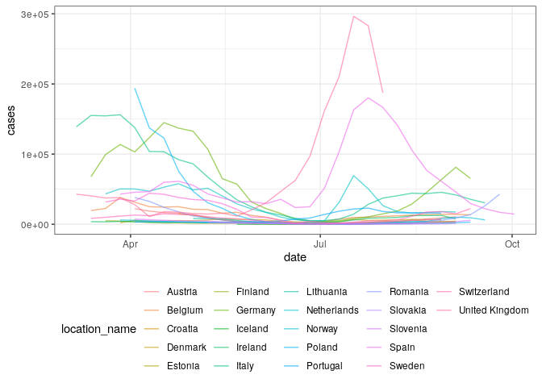
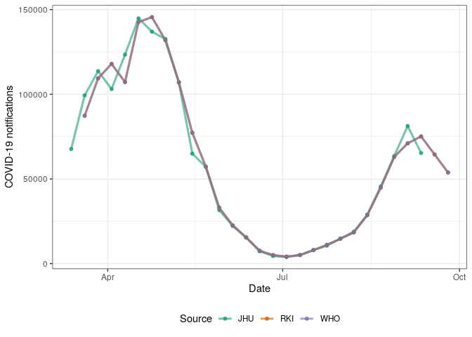
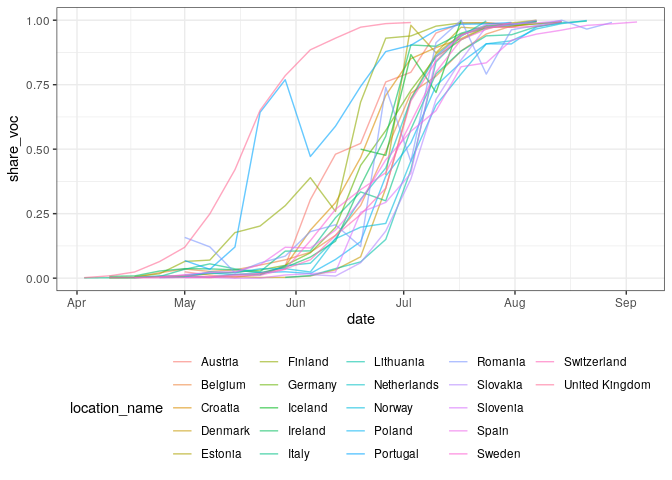
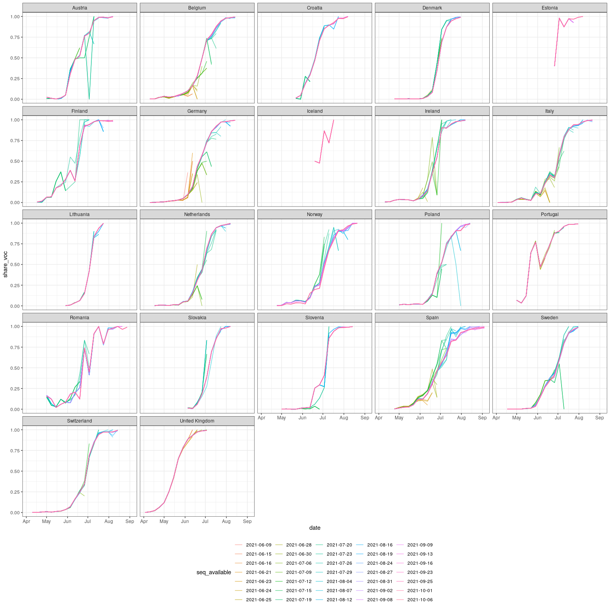

Aggregate case notification and sequence data for ECDC case studies
================

``` r
library(data.table)
library(jsonlite)
library(gh)
library(purrr)
library(ggplot2)
library(here)
library(covidregionaldata)
```

## Case notification data

  - Load truth data from the ECDC via the ECDC forecasting hub and
    process.

<!-- end list -->

``` r
cases <- fread("https://raw.githubusercontent.com/epiforecasts/covid19-forecast-hub-europe/main/data-truth/JHU/truth_JHU-Incident%20Cases.csv") # nolint

# Format date
cases[, date := as.Date(date)]

# Order data by date and location
setkey(cases, location_name, date)

# Summarise to weekly cases starting on Saturday to Sync with the forecast hubs
cases[, cases := frollsum(value, n = 7), by = c("location_name")]

# Filter from the 1st of January and keep only Saturdays
cases <- cases[date >= as.Date("2021-01-01")]
cases <- cases[weekdays(date) %in% "Saturday"]

# Only most recent case data is available
cases[, cases_available := date]

# Drop unnecessary columns
set(cases, j = c("value"), value = NULL)

# Summary
summary(cases)
```

    ##    location         location_name           date           
    ##  Length:1280        Length:1280        Min.   :2021-01-02  
    ##  Class :character   Class :character   1st Qu.:2021-03-11  
    ##  Mode  :character   Mode  :character   Median :2021-05-18  
    ##                                        Mean   :2021-05-18  
    ##                                        3rd Qu.:2021-07-25  
    ##                                        Max.   :2021-10-02  
    ##      cases         cases_available     
    ##  Min.   :-272773   Min.   :2021-01-02  
    ##  1st Qu.:   1575   1st Qu.:2021-03-11  
    ##  Median :   5587   Median :2021-05-18  
    ##  Mean   :  22716   Mean   :2021-05-18  
    ##  3rd Qu.:  18606   3rd Qu.:2021-07-25  
    ##  Max.   : 417620   Max.   :2021-10-02

## Sequence notification data

  - Define a function to download, load, and process sequence data from
    [covariants.org](https://covariants.org) (which itself process
    sequence data from [GISAID](https://www.gisaid.org)).

<!-- end list -->

``` r
download_covariants_sequences <- function(sha, path = "cluster_tables/21A.Delta_data.json") { # nolint
  if (missing(sha)) {
    url <- paste0(
      "https://raw.githubusercontent.com/hodcroftlab/covariants/master/", path
    )
  } else {
    url <- paste(
      "https://raw.githubusercontent.com/hodcroftlab/covariants",
      sha, path,
      sep = "/"
    )
  }
  sequences <- jsonlite::fromJSON(url)
  sequences <- purrr::map(sequences, as.data.table)
  sequences <- data.table::rbindlist(sequences, idcol = "location_name")
  return(sequences[])
}
```

  - Test by downloading the latest available data

<!-- end list -->

``` r
latest_sequences <- download_covariants_sequences()
latest_sequences
```

    ##             location_name       week total_sequences
    ##    1:               India 2020-04-27              73
    ##    2:               India 2020-05-04             170
    ##    3:               India 2020-05-11             237
    ##    4:               India 2020-05-18             288
    ##    5:               India 2020-05-25             330
    ##   ---                                               
    ## 4611: Trinidad and Tobago 2021-07-12               5
    ## 4612: Trinidad and Tobago 2021-07-19               7
    ## 4613: Trinidad and Tobago 2021-07-26              12
    ## 4614: Trinidad and Tobago 2021-08-02              19
    ## 4615: Trinidad and Tobago 2021-08-09              19
    ##       cluster_sequences unsmoothed_cluster_sequences
    ##    1:                 0                            0
    ##    2:                 0                            0
    ##    3:                 0                            0
    ##    4:                 0                            0
    ##    5:                 0                            0
    ##   ---                                               
    ## 4611:                 0                            0
    ## 4612:                 0                            0
    ## 4613:                 0                            1
    ## 4614:                 0                            1
    ## 4615:                 0                            0
    ##       unsmoothed_total_sequences
    ##    1:                        250
    ##    2:                        221
    ##    3:                        280
    ##    4:                        369
    ##    5:                        357
    ##   ---                           
    ## 4611:                          8
    ## 4612:                          3
    ## 4613:                         34
    ## 4614:                         15
    ## 4615:                         21

  - Get the commits to the target file in order to construct
    retrospective data

<!-- end list -->

``` r
covariants_file_commits <- function(path = "cluster_tables/21A.Delta_data.json") { # nolint
  commits <- gh::gh(
    "/repos/hodcroftlab/covariants/commits?path={path}",
    owner = "hodcroftlab",
    repo = "covariants",
    path = path, 
    .limit = 1000
  )

  commits <- purrr::map(
    commits,
    ~ data.table(
      date = as.Date(as.character(.$commit$committer$date)),
      datetime = lubridate::as_datetime(
        as.character(.$commit$committer$date)
      ),
      author = .$commit$committer$name,
      message = .$commit$message,
      sha = .$sha
    )
  )
  commits <- data.table::rbindlist(commits)
  return(commits[])
}

delta_sequence_commits <- covariants_file_commits()
delta_sequence_commits
```

    ##           date            datetime        author
    ##  1: 2021-10-06 2021-10-06 12:14:54 Emma Hodcroft
    ##  2: 2021-10-01 2021-10-01 20:20:21 Emma Hodcroft
    ##  3: 2021-09-25 2021-09-25 09:54:57 Emma Hodcroft
    ##  4: 2021-09-23 2021-09-23 13:07:51 Emma Hodcroft
    ##  5: 2021-09-16 2021-09-16 18:27:24 Emma Hodcroft
    ##  6: 2021-09-13 2021-09-13 23:21:26 Emma Hodcroft
    ##  7: 2021-09-13 2021-09-13 22:23:18 Emma Hodcroft
    ##  8: 2021-09-13 2021-09-13 21:25:16 Emma Hodcroft
    ##  9: 2021-09-09 2021-09-09 19:53:16 Emma Hodcroft
    ## 10: 2021-09-08 2021-09-08 09:09:40 Emma Hodcroft
    ## 11: 2021-09-02 2021-09-02 20:56:47 Emma Hodcroft
    ## 12: 2021-08-31 2021-08-31 17:23:10 Emma Hodcroft
    ## 13: 2021-08-27 2021-08-27 11:41:45 Emma Hodcroft
    ## 14: 2021-08-24 2021-08-24 16:03:34 Emma Hodcroft
    ## 15: 2021-08-19 2021-08-19 10:18:28 Emma Hodcroft
    ## 16: 2021-08-16 2021-08-16 13:42:49 Emma Hodcroft
    ## 17: 2021-08-12 2021-08-12 17:20:26 Emma Hodcroft
    ## 18: 2021-08-07 2021-08-07 19:06:34 Emma Hodcroft
    ## 19: 2021-08-07 2021-08-07 12:00:42 Emma Hodcroft
    ## 20: 2021-08-04 2021-08-04 12:40:46 Emma Hodcroft
    ## 21: 2021-07-29 2021-07-29 16:36:45 Emma Hodcroft
    ## 22: 2021-07-26 2021-07-26 19:10:57 Emma Hodcroft
    ## 23: 2021-07-23 2021-07-23 07:49:40 Emma Hodcroft
    ## 24: 2021-07-20 2021-07-20 12:31:24 Emma Hodcroft
    ## 25: 2021-07-19 2021-07-19 17:30:03 Emma Hodcroft
    ## 26: 2021-07-15 2021-07-15 13:45:20 Emma Hodcroft
    ## 27: 2021-07-12 2021-07-12 16:09:10 Emma Hodcroft
    ## 28: 2021-07-12 2021-07-12 12:09:29 Emma Hodcroft
    ## 29: 2021-07-09 2021-07-09 10:23:51 Emma Hodcroft
    ## 30: 2021-07-06 2021-07-06 12:28:54 Emma Hodcroft
    ## 31: 2021-06-30 2021-06-30 18:39:12 Emma Hodcroft
    ## 32: 2021-06-28 2021-06-28 09:59:18 Emma Hodcroft
    ## 33: 2021-06-25 2021-06-25 16:42:37 Emma Hodcroft
    ## 34: 2021-06-24 2021-06-24 09:28:09 Emma Hodcroft
    ## 35: 2021-06-23 2021-06-23 15:26:47 Emma Hodcroft
    ## 36: 2021-06-23 2021-06-23 11:53:16 Emma Hodcroft
    ## 37: 2021-06-21 2021-06-21 10:07:08 Emma Hodcroft
    ## 38: 2021-06-16 2021-06-16 02:18:51 Emma Hodcroft
    ## 39: 2021-06-16 2021-06-16 01:05:45 Emma Hodcroft
    ## 40: 2021-06-15 2021-06-15 23:42:47 Emma Hodcroft
    ## 41: 2021-06-09 2021-06-09 21:54:10 Emma Hodcroft
    ##           date            datetime        author
    ##                                             message
    ##  1:                                  new data 5 oct
    ##  2:                                new data 30 sept
    ##  3:                                new data 27 sept
    ##  4:                                new data 22 sept
    ##  5:                                new data 16 Sept
    ##  6:                                new data 13 sept
    ##  7:                     reverting to previous state
    ##  8:                                new data 13 Sept
    ##  9:                                 new data 9 sept
    ## 10:                                 new data 7 Sept
    ## 11:                                 new data 2 Sept
    ## 12:                                 new data 31 aug
    ## 13:                                 new data 26 Aug
    ## 14:                                 new data 24 Aug
    ## 15:                                 new data 18 aug
    ## 16:                                 new data 16 aug
    ## 17:                                 new data 12 Aug
    ## 18:                                  new data 9 Aug
    ## 19:                                  new data 6 aug
    ## 20:                                  new data 3 aug
    ## 21:                                new data 28 July
    ## 22:                                 new data 26 jul
    ## 23:                                 new data 22 Jul
    ## 24:                                 new data 19 jul
    ## 25:                                 new data 16 Jul
    ## 26:                                 new data 14 Jul
    ## 27:                    data replotted new var rules
    ## 28:                                  new data 9 jul
    ## 29:                                  new data 8 jul
    ## 30:                                 new data 6 july
    ## 31:                                 new data 29 Jun
    ## 32:                                 new data 26 jun
    ## 33:                                new data 24 June
    ## 34: new data generated using NextClade designations
    ## 35:                                new data 22 June
    ## 36:                        update data for new code
    ## 37:                                 new data 18 Jun
    ## 38:                         add back generated data
    ## 39:               temporarily delete generated data
    ## 40:                                 new data 15 jun
    ## 41:                                new data 09 June
    ##                                             message
    ##                                          sha
    ##  1: a24581f2f6cab04a499f6d892a9a25081010c6d0
    ##  2: 50744ec6940d1a1a7c8c5eb9024a708de262027e
    ##  3: e2e460eb2ba7ebb50452dd50660611839b4e5aa5
    ##  4: 5d48b9537052b0d51bef557ea9cc74da15e40a9e
    ##  5: aad7732893fe58464206ef5dac91c9e92324586b
    ##  6: 5f60ecf481dfb046ccf3dca5c86b780551f4458a
    ##  7: 8b4cb1438f41b8ed23f2f0bdd5c7012c8a0ffd40
    ##  8: 96fe12066eb71db9ab7679ee87a14d5735f8d0b4
    ##  9: c127f3ff4a9f8f208ed9064b4e9159d32a9b9818
    ## 10: ac958e9000ed08b7c6deb1622b9ffb47db7eae94
    ## 11: 0c7acdf40ca4ac3ae553bf412a988f085c68943a
    ## 12: 2430eb4e101c57505a630ddd894aa0c4b2ad70cf
    ## 13: 7cf11eec867fe928e1c5bd81f920a52cfe5b33ab
    ## 14: 4b6fa860c69ab47a723d5ce9f6f045a838710010
    ## 15: 351080f3f1589fd28ef9b422afce614a32265b4e
    ## 16: d71725a87033f93beb7fd24b8524a930a098c557
    ## 17: 129ae1643b1c4cbeb22e8d7544d4572b333220d9
    ## 18: 198da54a00d1ce80c9f1352b99a85771a6384470
    ## 19: ef6cbd29b7e428ff9b6549c8273b0b06151bc73f
    ## 20: cf043431414f7f67ff1256c6737b413ca13f460e
    ## 21: 0208e32e74c0bb6ddde5308a32454c5a07225777
    ## 22: 1de09fdb4c367caa00271ba50a734780237bbb02
    ## 23: 6b9722c2a1f215670f6624336d183175379eab4d
    ## 24: 3bcddc093bcf52eff245e4965d559d0e2970a78e
    ## 25: a022fda5d641f49b7ec0f3ed9107227a4a367d3c
    ## 26: 518ed2567557009307d0e9dbdfd1ef1646f175b1
    ## 27: 76a8638751df8add53cb0861dbdd3015e3730215
    ## 28: 1e9fb3051f7c02c8f994a9533e40daded3e30451
    ## 29: 4b8f686acb434b52e06f8035aab3e8bbbc0b7237
    ## 30: 3b7df3acae79ea0dee6afbfd8e673e799e14bbc0
    ## 31: 391f2da6da1d24eb32656c5f5b86f421d3cfc76f
    ## 32: 9469e2c735bb381e4d9bead9eac2f7e550ece97d
    ## 33: e07687cc89bd25013e780127ce493e81d509864e
    ## 34: 9e9ef20f25a41b44018d6c9607344eb48ceb4146
    ## 35: 7f58fae66e8e659a35eef80592d59e1af6c62802
    ## 36: 149c2a44908690b9de8d2b5fc89558d47fe2e02d
    ## 37: bb80637b82c01cc31326b1fde13a7f5e90332242
    ## 38: 04039249f76251602577a0266dc19f6e810158cd
    ## 39: a7dd05fc57db6913103b1e3a589cddc376a21dd5
    ## 40: d980cf76345ed621fe96e846c203604fb9ce1150
    ## 41: 27aa32ef2564eb5672f6c26f7f4f2e066ba4edbe
    ##                                          sha

  - Keep only the last commits from any given day and download data from
    this commit.

<!-- end list -->

``` r
sequences <- delta_sequence_commits[order(date)][,
  .SD[datetime == max(datetime)],
  by = date
]
setnames(sequences, "date", "seq_available")
sequences[, data := purrr::map(sha, download_covariants_sequences)]
sequences <- sequences[, rbindlist(data), by = seq_available]
sequences
```

    ##         seq_available       location_name       week
    ##      1:    2021-06-09               India 2020-04-27
    ##      2:    2021-06-09               India 2020-05-04
    ##      3:    2021-06-09               India 2020-05-11
    ##      4:    2021-06-09               India 2020-05-18
    ##      5:    2021-06-09               India 2020-05-25
    ##     ---                                             
    ## 100624:    2021-10-06 Trinidad and Tobago 2021-07-12
    ## 100625:    2021-10-06 Trinidad and Tobago 2021-07-19
    ## 100626:    2021-10-06 Trinidad and Tobago 2021-07-26
    ## 100627:    2021-10-06 Trinidad and Tobago 2021-08-02
    ## 100628:    2021-10-06 Trinidad and Tobago 2021-08-09
    ##         total_sequences cluster_sequences
    ##      1:              72                 0
    ##      2:             166                 0
    ##      3:             232                 0
    ##      4:             283                 0
    ##      5:             325                 0
    ##     ---                                  
    ## 100624:               5                 0
    ## 100625:               7                 0
    ## 100626:              12                 0
    ## 100627:              19                 0
    ## 100628:              19                 0
    ##         unsmoothed_cluster_sequences
    ##      1:                            0
    ##      2:                            0
    ##      3:                            0
    ##      4:                            0
    ##      5:                            0
    ##     ---                             
    ## 100624:                            0
    ## 100625:                            0
    ## 100626:                            1
    ## 100627:                            1
    ## 100628:                            0
    ##         unsmoothed_total_sequences
    ##      1:                        245
    ##      2:                        214
    ##      3:                        276
    ##      4:                        365
    ##      5:                        361
    ##     ---                           
    ## 100624:                          8
    ## 100625:                          3
    ## 100626:                         34
    ## 100627:                         15
    ## 100628:                         21

  - Select and rename variables of interest.

<!-- end list -->

``` r
sequences <- sequences[
  ,
  .(
    seq_available = seq_available,
    location_name,
    week_starting = as.Date(week),
    week_ending = as.Date(week) + 6,
    seq_voc = unsmoothed_cluster_sequences,
    seq_total = unsmoothed_total_sequences
  )
][, share_voc := seq_voc / seq_total][]
sequences
```

    ##         seq_available       location_name week_starting
    ##      1:    2021-06-09               India    2020-04-27
    ##      2:    2021-06-09               India    2020-05-04
    ##      3:    2021-06-09               India    2020-05-11
    ##      4:    2021-06-09               India    2020-05-18
    ##      5:    2021-06-09               India    2020-05-25
    ##     ---                                                
    ## 100624:    2021-10-06 Trinidad and Tobago    2021-07-12
    ## 100625:    2021-10-06 Trinidad and Tobago    2021-07-19
    ## 100626:    2021-10-06 Trinidad and Tobago    2021-07-26
    ## 100627:    2021-10-06 Trinidad and Tobago    2021-08-02
    ## 100628:    2021-10-06 Trinidad and Tobago    2021-08-09
    ##         week_ending seq_voc seq_total  share_voc
    ##      1:  2020-05-03       0       245 0.00000000
    ##      2:  2020-05-10       0       214 0.00000000
    ##      3:  2020-05-17       0       276 0.00000000
    ##      4:  2020-05-24       0       365 0.00000000
    ##      5:  2020-05-31       0       361 0.00000000
    ##     ---                                         
    ## 100624:  2021-07-18       0         8 0.00000000
    ## 100625:  2021-07-25       0         3 0.00000000
    ## 100626:  2021-08-01       1        34 0.02941176
    ## 100627:  2021-08-08       1        15 0.06666667
    ## 100628:  2021-08-15       0        21 0.00000000

## Filter, merge, and save cases notifications and sequences

  - Filter sequences to include dates by location starting from when two
    consecutive weeks have at least two sequences that were positive for
    the Delta variant and the Delta variant makes up at least 0.001% of
    available sequences. This filtering step is based on the first
    available data and then used as a common starting point across all
    releases. First find the introduction week for each location based
    on these filtering steps.

<!-- end list -->

``` r
first_seq <- sequences[,
  .SD[seq_available == min(seq_available)][
    seq_voc >= 2 & shift(seq_voc, type = "lead") >= 2
  ][
    share_voc >= 0.001 & shift(share_voc, type = "lead") >= 0.001
  ][
    order(week_ending)
  ][1, ],
  by = "location_name"
][!is.na(seq_voc)][]
first_seq
```

    ##      location_name seq_available week_starting week_ending
    ##  1:          India    2021-06-09    2021-02-15  2021-02-21
    ##  2:            USA    2021-06-09    2021-04-05  2021-04-11
    ##  3:        Germany    2021-06-09    2021-04-12  2021-04-18
    ##  4: United Kingdom    2021-06-09    2021-03-29  2021-04-04
    ##  5:      Singapore    2021-06-09    2021-03-29  2021-04-04
    ##  6:        Belgium    2021-06-15    2021-04-05  2021-04-11
    ##  7:         Russia    2021-06-21    2021-04-19  2021-04-25
    ##  8:          Spain    2021-06-21    2021-04-19  2021-04-25
    ##  9:          Italy    2021-06-23    2021-04-12  2021-04-18
    ## 10:      Indonesia    2021-06-25    2021-01-04  2021-01-10
    ## 11:        Ireland    2021-06-25    2021-04-05  2021-04-11
    ## 12:         France    2021-06-25    2021-04-12  2021-04-18
    ## 13:       Portugal    2021-06-25    2021-04-26  2021-05-02
    ## 14:        Denmark    2021-06-28    2021-04-19  2021-04-25
    ## 15:    Netherlands    2021-06-28    2021-04-12  2021-04-18
    ## 16:   South Africa    2021-06-30    2021-03-08  2021-03-14
    ## 17:      Australia    2021-07-06    2021-04-12  2021-04-18
    ## 18:         Canada    2021-07-06    2021-04-05  2021-04-11
    ## 19:          Japan    2021-07-06    2021-04-05  2021-04-11
    ## 20:         Sweden    2021-07-06    2021-04-05  2021-04-11
    ## 21:    Switzerland    2021-07-06    2021-04-05  2021-04-11
    ## 22:        Austria    2021-07-06    2021-05-17  2021-05-23
    ## 23:         Mexico    2021-07-06    2021-05-03  2021-05-09
    ## 24:         Israel    2021-07-09    2021-04-05  2021-04-11
    ## 25:        Romania    2021-07-12    2021-04-26  2021-05-02
    ## 26:          Kenya    2021-07-12    2021-04-26  2021-05-02
    ## 27:      Sri Lanka    2021-07-12    2021-06-07  2021-06-13
    ## 28:     Luxembourg    2021-07-12    2021-05-03  2021-05-09
    ## 29:         Norway    2021-07-12    2021-04-19  2021-04-25
    ## 30:          Qatar    2021-07-12    2021-04-12  2021-04-18
    ## 31:        Finland    2021-07-12    2021-04-26  2021-05-02
    ## 32:         Poland    2021-07-12    2021-04-26  2021-05-02
    ## 33: Czech Republic    2021-07-12    2021-05-03  2021-05-09
    ## 34:     Bangladesh    2021-07-12    2021-04-26  2021-05-02
    ## 35:       Malaysia    2021-07-12    2021-04-26  2021-05-02
    ## 36:       Botswana    2021-07-12    2021-05-24  2021-05-30
    ## 37:       Thailand    2021-07-12    2021-05-10  2021-05-16
    ## 38:         Latvia    2021-07-12    2021-05-10  2021-05-16
    ## 39:       Cambodia    2021-07-12    2021-05-24  2021-05-30
    ## 40:      Lithuania    2021-07-12    2021-05-24  2021-05-30
    ## 41:         Uganda    2021-08-04    2021-05-24  2021-05-30
    ## 42:        Lebanon    2021-08-16    2021-06-21  2021-06-27
    ## 43:    New Zealand    2021-08-24    2021-03-29  2021-04-04
    ## 44:        Estonia    2021-08-24    2021-06-21  2021-06-27
    ## 45:        Bahrain    2021-08-27    2021-05-03  2021-05-09
    ## 46:     Costa Rica    2021-08-27    2021-06-14  2021-06-20
    ## 47:     Mozambique    2021-08-27    2021-06-28  2021-07-04
    ## 48:       Zimbabwe    2021-08-31    2021-06-21  2021-06-27
    ## 49:       Pakistan    2021-09-02    2021-05-17  2021-05-23
    ## 50:        Iceland    2021-09-08    2021-06-14  2021-06-20
    ## 51:      Hong Kong    2021-09-25    2021-04-05  2021-04-11
    ## 52:         Kosovo    2021-10-01    2021-07-05  2021-07-11
    ## 53:         Zambia    2021-10-01    2021-05-24  2021-05-30
    ## 54:     Guadeloupe    2021-10-01    2021-07-19  2021-07-25
    ## 55:        Bonaire    2021-10-01    2021-07-05  2021-07-11
    ##      location_name seq_available week_starting week_ending
    ##     seq_voc seq_total   share_voc
    ##  1:       2       478 0.004184100
    ##  2:      49     35419 0.001383438
    ##  3:      18     10749 0.001674574
    ##  4:      22     12024 0.001829674
    ##  5:       2       107 0.018691589
    ##  6:       3      1268 0.002365931
    ##  7:       3        87 0.034482759
    ##  8:       2       865 0.002312139
    ##  9:       3      1649 0.001819284
    ## 10:       2       172 0.011627907
    ## 11:       5       697 0.007173601
    ## 12:       3      2942 0.001019714
    ## 13:       3        44 0.068181818
    ## 14:      12      3537 0.003392706
    ## 15:       4      1772 0.002257336
    ## 16:       7       242 0.028925620
    ## 17:      26        94 0.276595745
    ## 18:      13      2357 0.005515486
    ## 19:       7      2358 0.002968617
    ## 20:       3      2413 0.001243266
    ## 21:       3      1445 0.002076125
    ## 22:       2       234 0.008547009
    ## 23:      12       824 0.014563107
    ## 24:      26       187 0.139037433
    ## 25:       2        13 0.153846154
    ## 26:       9        68 0.132352941
    ## 27:       4        36 0.111111111
    ## 28:       4       333 0.012012012
    ## 29:       2       458 0.004366812
    ## 30:       3        91 0.032967033
    ## 31:      15       240 0.062500000
    ## 32:      15      1214 0.012355848
    ## 33:      11       133 0.082706767
    ## 34:      10        23 0.434782609
    ## 35:       3        33 0.090909091
    ## 36:       2         8 0.250000000
    ## 37:      52       303 0.171617162
    ## 38:       3       125 0.024000000
    ## 39:       3        24 0.125000000
    ## 40:       2       706 0.002832861
    ## 41:       4         4 1.000000000
    ## 42:       4         4 1.000000000
    ## 43:       3        18 0.166666667
    ## 44:       2         5 0.400000000
    ## 45:       3        12 0.250000000
    ## 46:       2        26 0.076923077
    ## 47:      13        13 1.000000000
    ## 48:       2         3 0.666666667
    ## 49:       7        13 0.538461538
    ## 50:       8        16 0.500000000
    ## 51:       2        34 0.058823529
    ## 52:       2         2 1.000000000
    ## 53:      85        85 1.000000000
    ## 54:      24        34 0.705882353
    ## 55:       3         6 0.500000000
    ##     seq_voc seq_total   share_voc

  - Restrict included sequences to start from these introduction dates.

<!-- end list -->

``` r
filt_sequences <- merge(
  sequences, first_seq[, .(location_name, intro_date = week_ending)],
  by = "location_name"
)
filt_sequences <- filt_sequences[week_ending >= intro_date][
  ,
  intro_date := NULL
][]
```

  - Find the week in each location when 99% of sequences are positive
    for Delta in the final sequence data for two consequetive weeks and
    more than 10 sequences are available.

<!-- end list -->

``` r
last_seq <- sequences[,
  .SD[seq_total > 10][
    share_voc >= 0.99 & shift(share_voc, type = "lead") >= 0.99
  ][
    order(week_ending)
  ][1, ],
  by = "location_name"
][!is.na(seq_voc)][]
last_seq
```

    ##       location_name seq_available week_starting week_ending
    ##  1:           India    2021-08-07    2021-07-05  2021-07-11
    ##  2:             USA    2021-08-31    2021-08-09  2021-08-15
    ##  3:         Germany    2021-08-27    2021-08-09  2021-08-15
    ##  4:  United Kingdom    2021-07-15    2021-06-28  2021-07-04
    ##  5:       Singapore    2021-07-29    2021-07-12  2021-07-18
    ##  6:         Belgium    2021-08-24    2021-08-09  2021-08-15
    ##  7:          Russia    2021-07-29    2021-06-28  2021-07-04
    ##  8:           Spain    2021-09-08    2021-08-23  2021-08-29
    ##  9:           Italy    2021-08-31    2021-08-09  2021-08-15
    ## 10:       Indonesia    2021-08-16    2021-07-26  2021-08-01
    ## 11:         Ireland    2021-09-02    2021-08-02  2021-08-08
    ## 12:          France    2021-09-25    2021-08-23  2021-08-29
    ## 13:        Portugal    2021-08-19    2021-07-26  2021-08-01
    ## 14:         Denmark    2021-08-07    2021-07-26  2021-08-01
    ## 15:     Netherlands    2021-08-31    2021-08-02  2021-08-08
    ## 16:    South Africa    2021-08-27    2021-08-02  2021-08-08
    ## 17:       Australia    2021-08-07    2021-07-12  2021-07-18
    ## 18:          Canada    2021-09-25    2021-08-16  2021-08-22
    ## 19:           Japan    2021-09-23    2021-08-30  2021-09-05
    ## 20:          Sweden    2021-09-02    2021-07-26  2021-08-01
    ## 21:     Switzerland    2021-08-31    2021-08-09  2021-08-15
    ## 22:         Austria    2021-09-13    2021-08-02  2021-08-08
    ## 23:          Mexico    2021-09-13    2021-08-23  2021-08-29
    ## 24:          Israel    2021-09-08    2021-07-19  2021-07-25
    ## 25:         Romania    2021-09-16    2021-08-23  2021-08-29
    ## 26:           Kenya    2021-09-08    2021-07-12  2021-07-18
    ## 27:     South Korea    2021-09-08    2021-08-09  2021-08-15
    ## 28:          Norway    2021-08-31    2021-08-09  2021-08-15
    ## 29:           Aruba    2021-08-31    2021-07-26  2021-08-01
    ## 30:         Finland    2021-09-25    2021-08-02  2021-08-08
    ## 31:        Slovenia    2021-08-16    2021-07-19  2021-07-25
    ## 32:          Malawi    2021-10-01    2021-07-12  2021-07-18
    ## 33:          Poland    2021-09-16    2021-08-09  2021-08-15
    ## 34:  Czech Republic    2021-08-16    2021-07-26  2021-08-01
    ## 35:      Bangladesh    2021-07-20    2021-06-21  2021-06-27
    ## 36:        Malaysia    2021-08-24    2021-07-12  2021-07-18
    ## 37:        Botswana    2021-08-07    2021-07-05  2021-07-11
    ## 38:          Turkey    2021-09-13    2021-08-23  2021-08-29
    ## 39:         Croatia    2021-09-25    2021-08-02  2021-08-08
    ## 40:       Lithuania    2021-08-16    2021-07-19  2021-07-25
    ## 41:        Slovakia    2021-08-24    2021-08-02  2021-08-08
    ## 42: North Macedonia    2021-08-24    2021-07-19  2021-07-25
    ## 43:         Curacao    2021-08-31    2021-07-26  2021-08-01
    ## 44:          Uganda    2021-08-24    2021-05-24  2021-05-30
    ## 45:         Lebanon    2021-08-16    2021-06-28  2021-07-04
    ## 46:     New Zealand    2021-08-24    2021-07-12  2021-07-18
    ## 47:         Estonia    2021-09-16    2021-08-02  2021-08-08
    ## 48:      Mozambique    2021-08-27    2021-06-28  2021-07-04
    ## 49:        Zimbabwe    2021-08-31    2021-07-05  2021-07-11
    ## 50:        Pakistan    2021-09-02    2021-08-09  2021-08-15
    ## 51:         Iceland    2021-09-08    2021-07-12  2021-07-18
    ## 52:       Hong Kong    2021-09-25    2021-06-14  2021-06-20
    ## 53:          Kosovo    2021-10-01    2021-08-02  2021-08-08
    ## 54:          Zambia    2021-10-01    2021-06-28  2021-07-04
    ## 55:      Guadeloupe    2021-10-01    2021-08-23  2021-08-29
    ## 56:         Bonaire    2021-10-01    2021-08-09  2021-08-15
    ##       location_name seq_available week_starting week_ending
    ##     seq_voc seq_total share_voc
    ##  1:     281       281 1.0000000
    ##  2:   23491     23727 0.9900535
    ##  3:    1292      1301 0.9930822
    ##  4:   21794     21926 0.9939798
    ##  5:     340       341 0.9970674
    ##  6:     572       577 0.9913345
    ##  7:      75        75 1.0000000
    ##  8:      86        86 1.0000000
    ##  9:     875       881 0.9931896
    ## 10:      52        52 1.0000000
    ## 11:     885       888 0.9966216
    ## 12:    2861      2883 0.9923691
    ## 13:     448       452 0.9911504
    ## 14:    4591      4623 0.9930781
    ## 15:     973       979 0.9938713
    ## 16:     171       171 1.0000000
    ## 17:     468       470 0.9957447
    ## 18:    2494      2513 0.9924393
    ## 19:      24        24 1.0000000
    ## 20:    1831      1848 0.9908009
    ## 21:     963       971 0.9917611
    ## 22:     228       229 0.9956332
    ## 23:     350       353 0.9915014
    ## 24:     200       201 0.9950249
    ## 25:     109       110 0.9909091
    ## 26:      73        73 1.0000000
    ## 27:     168       169 0.9940828
    ## 28:      85        85 1.0000000
    ## 29:      46        46 1.0000000
    ## 30:     656       661 0.9924357
    ## 31:     187       188 0.9946809
    ## 32:      12        12 1.0000000
    ## 33:     101       102 0.9901961
    ## 34:      48        48 1.0000000
    ## 35:      17        17 1.0000000
    ## 36:      12        12 1.0000000
    ## 37:      16        16 1.0000000
    ## 38:     252       253 0.9960474
    ## 39:     218       218 1.0000000
    ## 40:     430       431 0.9976798
    ## 41:     117       117 1.0000000
    ## 42:      13        13 1.0000000
    ## 43:      21        21 1.0000000
    ## 44:      11        11 1.0000000
    ## 45:      24        24 1.0000000
    ## 46:      31        31 1.0000000
    ## 47:     171       171 1.0000000
    ## 48:      13        13 1.0000000
    ## 49:      34        34 1.0000000
    ## 50:      32        32 1.0000000
    ## 51:      95        95 1.0000000
    ## 52:      12        12 1.0000000
    ## 53:      67        67 1.0000000
    ## 54:      26        26 1.0000000
    ## 55:      26        26 1.0000000
    ## 56:      24        24 1.0000000
    ##     seq_voc seq_total share_voc

  - Restrict included sequences to stop at these dates.

<!-- end list -->

``` r
filt_sequences <- merge(
  sequences, last_seq[, .(location_name, end_date = week_ending)],
  by = "location_name"
)
filt_sequences[is.na(end_date), end_date := max(week_ending),
  by = "location_name"
]
filt_sequences <- filt_sequences[week_ending <= end_date][
  ,
  end_date := NULL
][]
```

  - Filter case notifications to start 4 weeks prior to the introduction
    date of the Delta variant and to stop 4 weeks after Delta has become
    dominant.

<!-- end list -->

``` r
filt_cases <- Reduce(
  function(x, y) {
    merge(x, y, by = "location_name", all.x = TRUE)
  },
  list(
    cases,
    first_seq[, .(location_name, intro_date = week_ending)],
    last_seq[, .(location_name, end_date = week_ending)]
  )
)
filt_cases <- filt_cases[date >= (intro_date - 7 * 4)]
filt_cases <- filt_cases[date <= (end_date + 7 * 4)]
filt_cases[, c("intro_date", "end_date") := NULL]
```

  - Merge duplicating case data for all sequence versions. Sequences are
    only available aggregated by week from Sunday. Approximate the same
    timespan as the case data by changing the weekly reference date

<!-- end list -->

``` r
adjusted_seq <- copy(filt_sequences)[
  ,
  date := week_ending - 1
][, c("week_starting", "week_ending") := NULL]

notifications <- merge(filt_cases, adjusted_seq,
  by = c("date", "location_name"), all.x = TRUE
)
setorder(notifications, seq_available)
setorder(notifications, location_name, date)
setorderv(notifications, c("location_name", "date", "seq_available"))
```

  - Check data for negative values and drop countries if present

<!-- end list -->

``` r
problem_countries <- unique(
  notifications[cases < 0 | seq_total < 0]$location_name
)
problem_countries
```

    ## [1] "France"

``` r
notifications <- notifications[!(location_name %in% problem_countries)]
```

  - Save and summarise filtered notification data.

<!-- end list -->

``` r
# save to observations folder
fwrite(notifications, file = here("data/observations/covariants.csv"))

# Summary
summary(notifications)
```

    ##       date            location_name        location        
    ##  Min.   :2021-03-13   Length:8326        Length:8326       
    ##  1st Qu.:2021-05-01   Class :character   Class :character  
    ##  Median :2021-05-29   Mode  :character   Mode  :character  
    ##  Mean   :2021-05-29                                        
    ##  3rd Qu.:2021-06-26                                        
    ##  Max.   :2021-09-25                                        
    ##                                                            
    ##      cases        cases_available      seq_available       
    ##  Min.   :    10   Min.   :2021-03-13   Min.   :2021-06-09  
    ##  1st Qu.:  2875   1st Qu.:2021-05-01   1st Qu.:2021-07-23  
    ##  Median :  7843   Median :2021-05-29   Median :2021-08-19  
    ##  Mean   : 23348   Mean   :2021-05-29   Mean   :2021-08-18  
    ##  3rd Qu.: 30724   3rd Qu.:2021-06-26   3rd Qu.:2021-09-09  
    ##  Max.   :296447   Max.   :2021-09-25   Max.   :2021-10-06  
    ##                                        NA's   :76          
    ##     seq_voc          seq_total       share_voc      
    ##  Min.   :    0.0   Min.   :    1   Min.   :0.00000  
    ##  1st Qu.:    5.0   1st Qu.:  337   1st Qu.:0.00596  
    ##  Median :   38.0   Median : 1044   Median :0.06686  
    ##  Mean   :  688.8   Mean   : 2241   Mean   :0.30881  
    ##  3rd Qu.:  258.0   3rd Qu.: 1830   3rd Qu.:0.68235  
    ##  Max.   :30917.0   Max.   :31194   Max.   :1.00000  
    ##  NA's   :76        NA's   :76      NA's   :76

## Explore notifications

  - Case notifications

<!-- end list -->

``` r
not_cases <- unique(notifications[, .(date, cases, location_name)])
# plot cases
ggplot(not_cases) +
  aes(x = date, y = cases, col = location_name) +
  geom_line(alpha = 0.6) +
  theme_bw() +
  theme(legend.position = "bottom")
```

<!-- -->

  - Case notifications normalised by maximum number of notifications in
    that location.

<!-- end list -->

``` r
ggplot(copy(not_cases)[, cases := cases / max(cases), by = "location_name"]) +
  aes(x = date, y = cases, col = location_name) +
  geom_line(alpha = 0.6) +
  theme_bw() +
  theme(legend.position = "bottom")
```

<!-- -->

  - Compare case notifications in Germany in this data with case
    notifications in the RKI data source and the WHO data source.

<!-- end list -->

``` r
# get comparison data sources
rki <- fread(here("data", "observations", "rki.csv"))
who <- setDT(
  covidregionaldata::get_national_data(
    "Germany", source = "WHO", verbose = FALSE
  )
)
# make the who data source weekly
who[, cases := frollsum(cases_new, n = 7)]
who <- who[weekdays(date) %in% "Saturday"]

germany <- rbind(
  unique(rki[, .(date = as.Date(date), cases, source = "RKI")]),
  not_cases[location_name == "Germany"][,
     .(date, cases, source = "JHU")],
  who[date >= min(rki$date) & date <= max(rki$date)][,
      .(date, cases = cases, source = "WHO")]
)

ggplot(germany) +
  aes(x = date, y = cases, col = source) +
  geom_point(size = 1.4, alpha = 0.8) +
  geom_line(size = 1.1, alpha = 0.6) +
  scale_colour_brewer(palette = "Dark2") +
  theme_bw() +
  theme(legend.position = "bottom") +
  labs(x = "Date", y = "COVID-19 notifications", col = "Source")
```

<!-- -->

  - Share of sequences that were positive for the Delta variant based on
    the lastest available data.

<!-- end list -->

``` r
ggplot(notifications[seq_available == max(seq_available, na.rm = TRUE)]) +
  aes(x = date, y = share_voc, col = location_name) +
  geom_line(alpha = 0.6) +
  theme_bw() +
  theme(legend.position = "bottom")
```

<!-- -->

  - Share of sequences that were positive for the Delta variant based on
    the first available data.

<!-- end list -->

``` r
ggplot(notifications[seq_available == min(seq_available, na.rm = TRUE)]) +
  aes(x = date, y = share_voc, col = location_name) +
  geom_line(alpha = 0.6) +
  theme_bw() +
  theme(legend.position = "bottom")
```

<!-- -->

  - Share of sequences positive for Delta by availability

<!-- end list -->

``` r
ggplot(
  notifications[!is.na(seq_available)][
    ,
    seq_available := as.factor(seq_available)
  ]
) +
  aes(x = date, y = share_voc, col = seq_available) +
  geom_line(alpha = 0.6) +
  theme_bw() +
  theme(legend.position = "bottom") +
  facet_wrap(vars(location_name))
```

<!-- -->

  - Relative change in the proportion of sequences that were Delta
    between each release of sequence data and the latest available
    release.

<!-- end list -->

``` r
latest_seq <- notifications[,
  n := .N,
  by = c("date", "location_name")
][, .SD[seq_available == max(seq_available)],
  by = c("date", "location_name")
][n > 1]

seq_change <- merge(
  notifications[!is.na(seq_available)][
    ,
    seq_available := as.factor(seq_available)
  ][
    ,
    .(location_name, date, share_voc, seq_available)
  ],
  latest_seq[, .(location_name, date, latest_voc = share_voc)],
  by = c("location_name", "date")
)

seq_change[, per_latest := share_voc / latest_voc]

seq_change <- seq_change[date <= as.Date("2021-09-01")]

ggplot(seq_change) +
  aes(x = date, y = per_latest, col = seq_available, group = seq_available) +
  geom_point(size = 1.1, alpha = 0.8) +
  geom_line(alpha = 0.6) +
  theme_bw() +
  theme(legend.position = "bottom") +
  facet_wrap(vars(location_name), scales = "free")
```

    ## Warning: Removed 842 rows containing missing values
    ## (geom_point).

    ## Warning: Removed 27 row(s) containing missing values
    ## (geom_path).

<!-- -->
