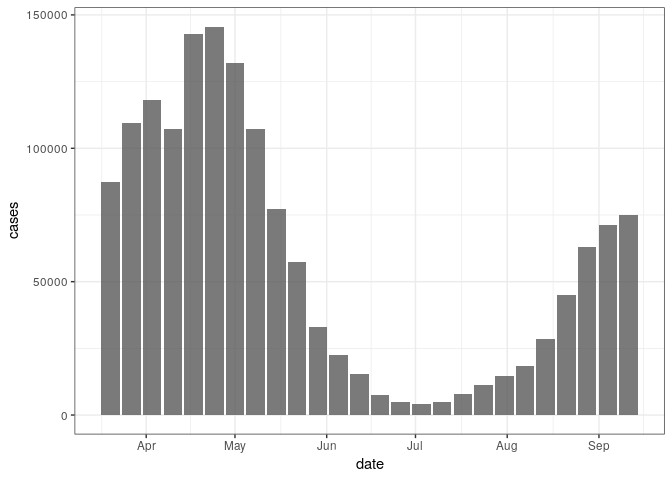
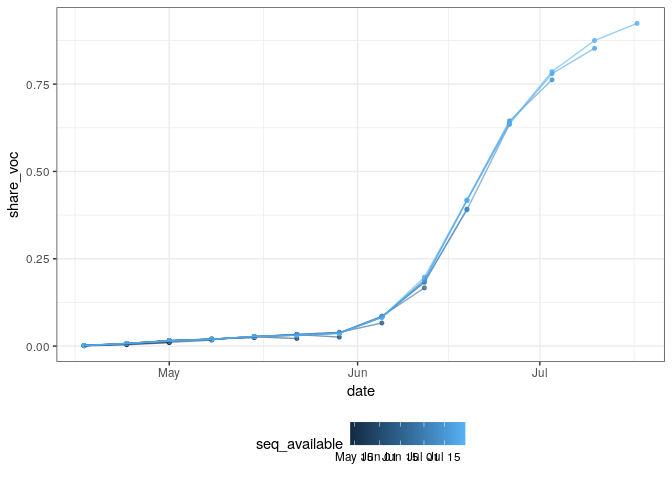
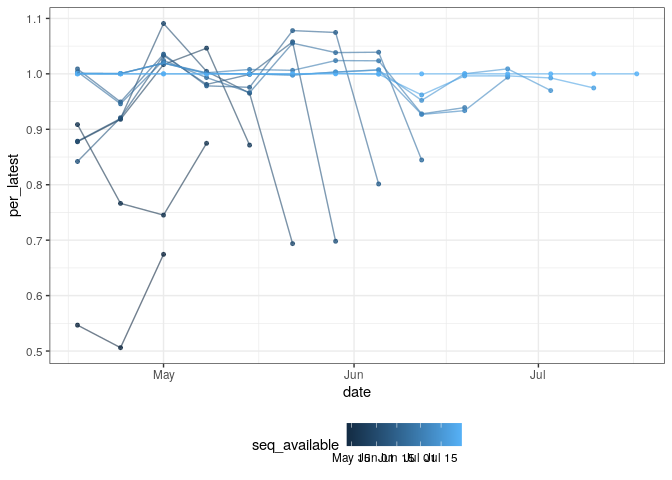

Aggregate case notification and sequence data for Germany
================

``` r
library(data.table)
library(ggplot2)
library(here)
```

## Case notification data

  - Load truth data from the RKI via the Germany/Poland forecasting hub
    and process.

<!-- end list -->

``` r
cases <- fread("https://raw.githubusercontent.com/KITmetricslab/covid19-forecast-hub-de/master/data-truth/RKI/truth_RKI-Incident%20Cases_Germany.csv") # nolint

# Restrict to cases in Germany and format date
cases <- cases[location == "GM"]
cases[, date := as.Date(date)]

# Summarise to weekly cases starting on Saturday to Sync with the forecast hubs
cases[, cases := frollsum(value, n = 7)]

# Filter from the 20th March and keep only Saturdays
cases <- cases[date >= as.Date("2021-03-20")]
cases <- cases[weekdays(date) %in% "Saturday"]

# Only most recennt case data is available
cases[, cases_available := date]

# Drop unnecessary columns
set(cases, j = c("value", "location", "location_name"), value = NULL)

# Summary
summary(cases)
```

    ##       date                cases        cases_available     
    ##  Min.   :2021-03-20   Min.   :  4181   Min.   :2021-03-20  
    ##  1st Qu.:2021-05-02   1st Qu.: 14879   1st Qu.:2021-05-02  
    ##  Median :2021-06-15   Median : 51086   Median :2021-06-15  
    ##  Mean   :2021-06-15   Mean   : 58148   Mean   :2021-06-15  
    ##  3rd Qu.:2021-07-29   3rd Qu.:102188   3rd Qu.:2021-07-29  
    ##  Max.   :2021-09-11   Max.   :145568   Max.   :2021-09-11

# Sequence notification data

  - Sequence data sourced from RKI reports see the SI for more details.

<!-- end list -->

``` r
sequences <- fread("https://raw.githubusercontent.com/dwolffram/covid19-variants/main/data/sequencing_germany.csv") # nolint

# Get total sequence count
sequences[, seq_total := rowSums(.SD, na.rm = TRUE),
  .SDcols = grep("_count", colnames(sequences))
]

# Pull out and format variables of interest
sequences <- sequences[
  ,
  .(
    date = week_end, seq_total, seq_voc = B.1.617.2_count,
    share_voc = B.1.617.2_proportion / 100, seq_available
  )
]

# Check sequence totals and proportions
sequences[, est_seq_total := seq_voc / share_voc]

# Replace proprotion using totals and voc sequences
sequences[, share_voc := seq_voc / seq_total][, est_seq_total := NULL]

# Include sequences from 18th of April
sequences <- sequences[date >= as.Date("2021-04-18")]

# Summary
summary(sequences)
```

    ##       date              seq_total       seq_voc        share_voc        
    ##  Min.   :2021-04-18   Min.   : 452   Min.   :  3.0   Min.   :0.0007985  
    ##  1st Qu.:2021-05-02   1st Qu.:1801   1st Qu.: 34.0   1st Qu.:0.0119119  
    ##  Median :2021-05-16   Median :3616   Median : 89.0   Median :0.0264457  
    ##  Mean   :2021-05-19   Mean   :2992   Mean   :134.2   Mean   :0.1231187  
    ##  3rd Qu.:2021-06-06   3rd Qu.:4088   3rd Qu.:143.0   3rd Qu.:0.0823743  
    ##  Max.   :2021-07-18   Max.   :4547   Max.   :643.0   Max.   :0.9237589  
    ##  seq_available       
    ##  Min.   :2021-05-12  
    ##  1st Qu.:2021-06-16  
    ##  Median :2021-06-30  
    ##  Mean   :2021-06-29  
    ##  3rd Qu.:2021-07-22  
    ##  Max.   :2021-07-29

# Merge, explore, and save data

``` r
# merge duplicating case data for all sequence versions
# Sequences are only available aggregated by week from Sunday
# Approximate the same timespan as the case data by changing the
# weekly reference date
notifications <- merge(cases, copy(sequences)[, date := date - 1],
                       by = "date", all.x = TRUE)

# save to observations folder
fwrite(notifications, file = here("data/observations/germany.csv"))

# Summary
summary(notifications)
```

    ##       date                cases        cases_available        seq_total       seq_voc     
    ##  Min.   :2021-03-20   Min.   :  4181   Min.   :2021-03-20   Min.   : 452   Min.   :  3.0  
    ##  1st Qu.:2021-05-01   1st Qu.: 22631   1st Qu.:2021-05-01   1st Qu.:1801   1st Qu.: 34.0  
    ##  Median :2021-05-15   Median : 77261   Median :2021-05-15   Median :3616   Median : 89.0  
    ##  Mean   :2021-05-22   Mean   : 77741   Mean   :2021-05-22   Mean   :2992   Mean   :134.2  
    ##  3rd Qu.:2021-06-10   3rd Qu.:131887   3rd Qu.:2021-06-10   3rd Qu.:4088   3rd Qu.:143.0  
    ##  Max.   :2021-09-11   Max.   :145568   Max.   :2021-09-11   Max.   :4547   Max.   :643.0  
    ##                                                             NA's   :12     NA's   :12     
    ##    share_voc        seq_available       
    ##  Min.   :0.000799   Min.   :2021-05-12  
    ##  1st Qu.:0.011912   1st Qu.:2021-06-16  
    ##  Median :0.026446   Median :2021-06-30  
    ##  Mean   :0.123119   Mean   :2021-06-29  
    ##  3rd Qu.:0.082374   3rd Qu.:2021-07-22  
    ##  Max.   :0.923759   Max.   :2021-07-29  
    ##  NA's   :12         NA's   :12

``` r
# plot cases
ggplot(unique(notifications[, .(date, cases)])) +
  aes(x = date, y = cases) +
  geom_col(alpha = 0.8) +
  theme_bw()
```

<!-- -->

``` r
# plot sequences
ggplot(notifications[!is.na(share_voc)]) +
  aes(x = date, y = share_voc, col = seq_available, group = seq_available) +
  geom_point(size = 1.1, alpha = 0.8) +
  geom_line(alpha = 0.6) +
  theme_bw() +
  theme(legend.position = "bottom")
```

<!-- -->

``` r
# plot sequence % change based on latest available
latest_seq <- notifications[, .SD[seq_available == max(seq_available)],
  by = date
]

seq_change <- merge(
  notifications[, .(date, share_voc, seq_available)],
  latest_seq[, .(date, latest_voc = share_voc)],
  by = "date"
)

seq_change[, per_latest := share_voc / latest_voc]

ggplot(seq_change) +
  aes(x = date, y = per_latest, col = seq_available, group = seq_available) +
  geom_point(size = 1.1, alpha = 0.8) +
  geom_line(alpha = 0.6) +
  theme_bw() +
  theme(legend.position = "bottom")
```

<!-- -->
